# Digital Memory System - Vollständige Implementierungsdokumentation

## Executive Summary

Das Digital Memory System ist ein lokal laufendes, KI-integriertes Gedächtnissystem, das auf dem menschlichen Gedächtnismodell basiert. Es ermöglicht intelligente Speicherung, Abruf und Verwaltung von Informationen über drei Gedächtnisebenen: Kurzzeitgedächtnis, episodisches Gedächtnis und Langzeitgedächtnis.

**Kernmerkmale:**

- Drei-Schichten Gedächtnisarchitektur nach kognitionspsychologischem Modell
- Model Context Protocol (MCP) Server für nahtlose KI-Integration
- Lokale Vektordatenbank für semantische Suche
- Markdown-basierte Datenhaltung mit Obsidian-Kompatibilität
- Vollständige Datensouveränität durch lokale Ausführung
- Intelligente, KI-gesteuerte Gedächtniskonsolidierung

**Projektziele:**

1. Aufbau eines persistent verfügbaren digitalen Gedächtnisses für KI-Assistenten
2. Ermöglichung kontextueller, zeitlich unbegrenzter Konversationen
3. Semantische Suche über persönliche Notizen und Erfahrungen
4. Automatische Wissensorganisation und -konsolidierung

------

## 1. Projektübersicht und Scope

### 1.1 Projektvision

Das Digital Memory System schafft eine Brücke zwischen kurzfristigen Gesprächen mit KI-Assistenten und langfristigem Wissensspeicher. Ähnlich wie das menschliche Gehirn organisiert es Informationen nach Relevanz, Zeitlichkeit und Kontext.

### 1.2 Hauptakteure

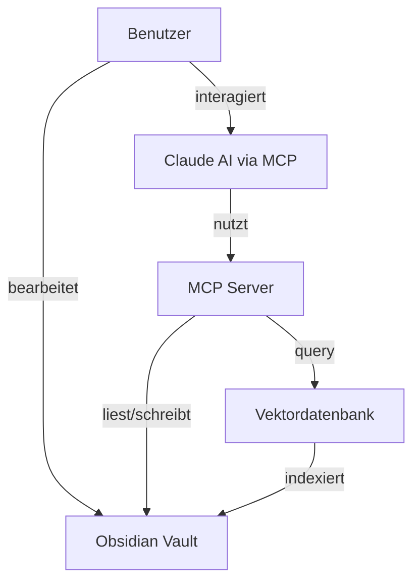
```mermaid
graph TB
    User[Benutzer]
    Claude[Claude AI via MCP]
    Obsidian[Obsidian Vault]
    MCP[MCP Server]
    VectorDB[Vektordatenbank]
    
    User -->|interagiert| Claude
    User -->|bearbeitet| Obsidian
    Claude -->|nutzt| MCP
    MCP -->|liest/schreibt| Obsidian
    MCP -->|query| VectorDB
    VectorDB -->|indexiert| Obsidian
```

### 1.3 Abgrenzung (Out of Scope)

- Cloud-basierte Synchronisation
- Multi-User Funktionalität
- Mobile Apps (initial)
- Echtzeit-Kollaboration
- Verschlüsselung auf Dateiebene (nutzt OS-Verschlüsselung)

------

## 2. Systemarchitektur

### 2.1 Gesamtarchitektur

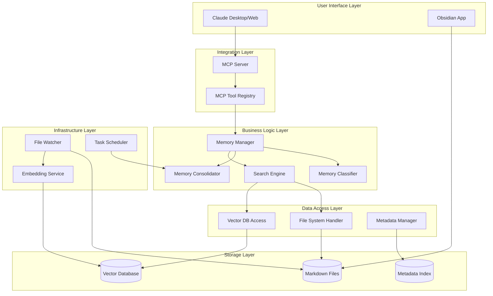
```mermaid
graph TB
    subgraph "User Interface Layer"
        Claude[Claude Desktop/Web]
        Obsidian[Obsidian App]
    end
    
    subgraph "Integration Layer"
        MCP[MCP Server]
        MCPTools[MCP Tool Registry]
    end
    
    subgraph "Business Logic Layer"
        MemoryManager[Memory Manager]
        Classifier[Memory Classifier]
        Consolidator[Memory Consolidator]
        SearchEngine[Search Engine]
    end
    
    subgraph "Data Access Layer"
        FileSystem[File System Handler]
        VectorAccess[Vector DB Access]
        MetadataManager[Metadata Manager]
    end
    
    subgraph "Storage Layer"
        MarkdownFiles[(Markdown Files)]
        VectorDB[(Vector Database)]
        IndexDB[(Metadata Index)]
    end
    
    subgraph "Infrastructure Layer"
        FileWatcher[File Watcher]
        EmbeddingService[Embedding Service]
        Scheduler[Task Scheduler]
    end
    
    Claude --> MCP
    Obsidian --> MarkdownFiles
    MCP --> MCPTools
    MCPTools --> MemoryManager
    MemoryManager --> Classifier
    MemoryManager --> Consolidator
    MemoryManager --> SearchEngine
    SearchEngine --> FileSystem
    SearchEngine --> VectorAccess
    FileSystem --> MarkdownFiles
    VectorAccess --> VectorDB
    MetadataManager --> IndexDB
    FileWatcher --> MarkdownFiles
    FileWatcher --> EmbeddingService
    EmbeddingService --> VectorDB
    Scheduler --> Consolidator
```

### 2.2 Drei-Schichten Gedächtnismodell

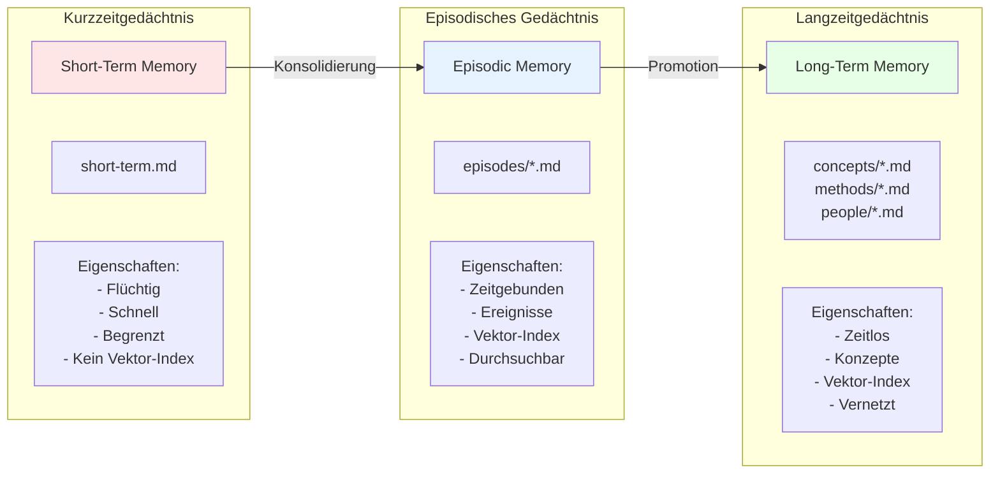
```mermaid
graph LR
    subgraph "Kurzzeitgedächtnis"
        STM[Short-Term Memory]
        STMFile[short-term.md]
        STMProps[Eigenschaften:<br/>- Flüchtig<br/>- Schnell<br/>- Begrenzt<br/>- Kein Vektor-Index]
    end
    
    subgraph "Episodisches Gedächtnis"
        EPM[Episodic Memory]
        EPMFiles[episodes/*.md]
        EPMProps[Eigenschaften:<br/>- Zeitgebunden<br/>- Ereignisse<br/>- Vektor-Index<br/>- Durchsuchbar]
    end
    
    subgraph "Langzeitgedächtnis"
        LTM[Long-Term Memory]
        LTMFiles[concepts/*.md<br/>methods/*.md<br/>people/*.md]
        LTMProps[Eigenschaften:<br/>- Zeitlos<br/>- Konzepte<br/>- Vektor-Index<br/>- Vernetzt]
    end
    
    STM -->|Konsolidierung| EPM
    EPM -->|Promotion| LTM
    
    style STM fill:#FFE6E6
    style EPM fill:#E6F3FF
    style LTM fill:#E6FFE6
```

### 2.3 Datenfluss

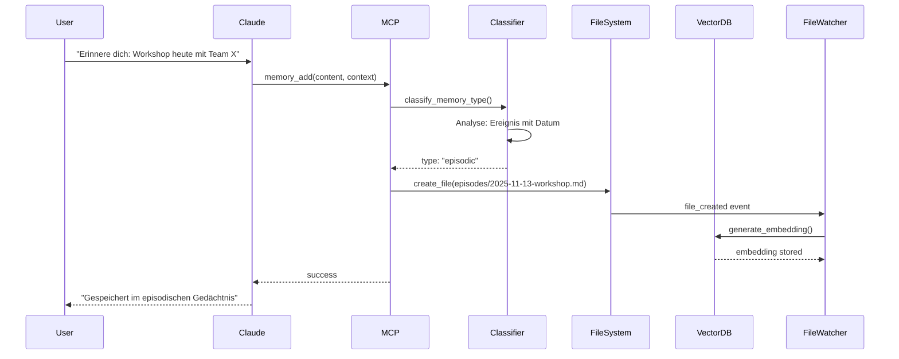
```mermaid
sequenceDiagram
    participant User
    participant Claude
    participant MCP
    participant Classifier
    participant FileSystem
    participant VectorDB
    participant FileWatcher
    
    User->>Claude: "Erinnere dich: Workshop heute mit Team X"
    Claude->>MCP: memory_add(content, context)
    MCP->>Classifier: classify_memory_type()
    Classifier->>Classifier: Analyse: Ereignis mit Datum
    Classifier-->>MCP: type: "episodic"
    MCP->>FileSystem: create_file(episodes/2025-11-13-workshop.md)
    FileSystem->>FileWatcher: file_created event
    FileWatcher->>VectorDB: generate_embedding()
    VectorDB-->>FileWatcher: embedding stored
    MCP-->>Claude: success
    Claude-->>User: "Gespeichert im episodischen Gedächtnis"
```

------

## 3. Funktionale Anforderungen

### 3.1 Gedächtnis-Operationen

#### FR-001: Kurzzeitgedächtnis Verwaltung

**Beschreibung:** Das System ermöglicht das Hinzufügen, Lesen und Löschen von Kurzzeitgedächtnis-Einträgen.

**Akteure:** Claude AI, Benutzer

**Vorbedingungen:**

- MCP Server ist gestartet
- Kurzzeitgedächtnis-Datei existiert oder kann erstellt werden

**Ablauf:**

1. Claude entscheidet, dass Information ins Kurzzeitgedächtnis gehört
2. System fügt Information zu short-term.md hinzu
3. Information wird mit Zeitstempel versehen
4. System bestätigt Speicherung

**Nachbedingungen:**

- Information ist in short-term.md verfügbar
- Keine Vektorisierung erfolgt
- Information ist unmittelbar abrufbar

**Akzeptanzkriterien:**

- Antwortzeit < 100ms
- Maximale Größe: 2000 Wörter
- Automatisches Archivieren bei Überschreitung

#### FR-002: Episodisches Gedächtnis Speicherung

**Beschreibung:** Das System speichert Ereignisse, Erlebnisse und zeitgebundene Informationen im episodischen Gedächtnis.

**Akteure:** Claude AI

**Vorbedingungen:**

- MCP Server ist gestartet
- Episodes-Verzeichnis existiert

**Ablauf:**

1. Claude klassifiziert Information als episodisch
2. System erstellt neue Markdown-Datei mit Datums-Präfix
3. Metadaten werden im Frontmatter gespeichert
4. File Watcher erkennt neue Datei
5. Embedding wird generiert und in Vektordatenbank gespeichert

**Nachbedingungen:**

- Episode ist als Markdown-Datei gespeichert
- Episode ist vektorisiert und semantisch durchsuchbar
- Metadaten sind indexiert

**Akzeptanzkriterien:**

- Dateiname folgt Schema: YYYY-MM-DD-titel.md
- Frontmatter enthält: title, date, tags, location
- Embedding-Generierung erfolgt innerhalb von 5 Sekunden

#### FR-003: Langzeitgedächtnis Verwaltung

**Beschreibung:** Das System speichert und verwaltet zeitloses Wissen, Konzepte und Methoden.

**Akteure:** Claude AI

**Vorbedingungen:**

- MCP Server ist gestartet
- Entsprechende Unterverzeichnisse existieren (concepts/, methods/, people/)

**Ablauf:**

1. Claude klassifiziert Information als Langzeitwissen
2. System bestimmt passende Kategorie
3. Markdown-Datei wird erstellt oder aktualisiert
4. Bi-direktionale Links werden erkannt und gespeichert
5. Embedding wird generiert

**Nachbedingungen:**

- Konzept ist persistent gespeichert
- Konzept ist semantisch durchsuchbar
- Verlinkungen sind bidirektional auflösbar

**Akzeptanzkriterien:**

- Unterstützt Wiki-Links [[other-note]]
- Automatische Backlink-Erkennung
- Tag-basierte Organisation

### 3.2 Such-Operationen

#### FR-004: Volltext-Suche

**Beschreibung:** Das System ermöglicht Volltext-Suche über alle Gedächtnisebenen.

**Funktionsweise:**

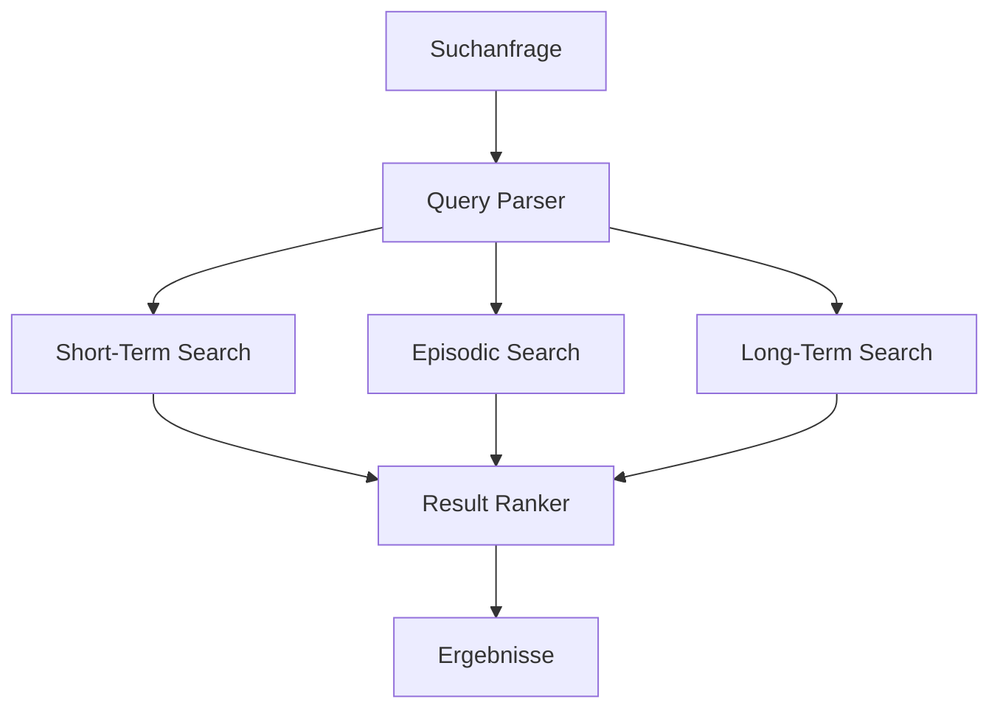
```mermaid
graph TD
    Query[Suchanfrage]
    Parser[Query Parser]
    STSearch[Short-Term Search]
    EPSearch[Episodic Search]
    LTSearch[Long-Term Search]
    Ranker[Result Ranker]
    Results[Ergebnisse]
    
    Query --> Parser
    Parser --> STSearch
    Parser --> EPSearch
    Parser --> LTSearch
    STSearch --> Ranker
    EPSearch --> Ranker
    LTSearch --> Ranker
    Ranker --> Results
```

**Akzeptanzkriterien:**

- Suche über alle drei Gedächtnisebenen
- Regex-Unterstützung
- Ergebnisse nach Relevanz sortiert
- Antwortzeit < 500ms für < 10.000 Dokumente

#### FR-005: Semantische Suche

**Beschreibung:** Das System ermöglicht semantische Suche über episodisches und Langzeitgedächtnis mittels Vektorähnlichkeit.

**Funktionsweise:**

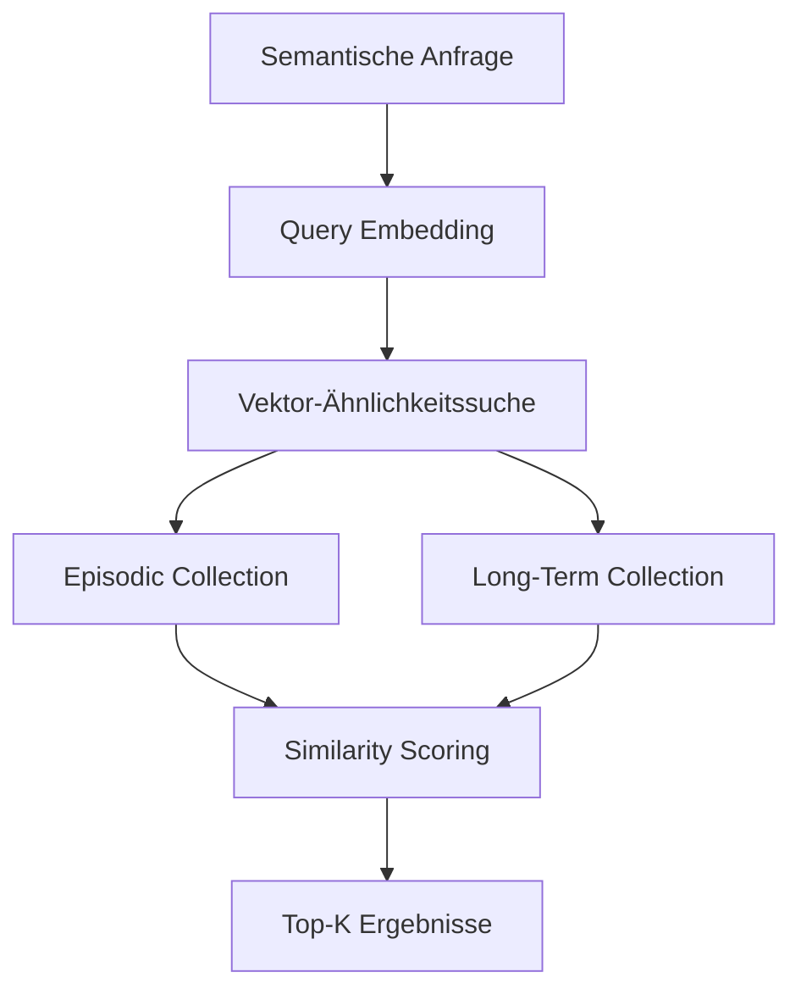
```mermaid
graph TD
    Query[Semantische Anfrage]
    Embed[Query Embedding]
    VectorSearch[Vektor-Ähnlichkeitssuche]
    EPCollection[Episodic Collection]
    LTCollection[Long-Term Collection]
    Similarity[Similarity Scoring]
    Results[Top-K Ergebnisse]
    
    Query --> Embed
    Embed --> VectorSearch
    VectorSearch --> EPCollection
    VectorSearch --> LTCollection
    EPCollection --> Similarity
    LTCollection --> Similarity
    Similarity --> Results
```

**Akzeptanzkriterien:**

- Findet semantisch ähnliche Inhalte auch ohne Keyword-Match
- Konfigurierbare Ähnlichkeitsschwelle
- Top-K Ergebnisse mit Similarity-Score
- Antwortzeit < 200ms

#### FR-006: Zeitbasierte Suche

**Beschreibung:** Das System ermöglicht Suche nach Zeiträumen im episodischen Gedächtnis.

**Suchparameter:**

- Exaktes Datum
- Zeitspanne (von-bis)
- Relative Zeitangaben (letzte Woche, letzter Monat)

**Akzeptanzkriterien:**

- Chronologische Sortierung
- Unterstützung für ISO 8601 Datumsformate
- Timeline-Visualisierung der Ergebnisse

### 3.3 Gedächtnis-Konsolidierung

#### FR-007: Memory Promotion

**Beschreibung:** Das System ermöglicht die Überführung von episodischem Gedächtnis in Langzeitwissen.

**Promotion-Prozess:**

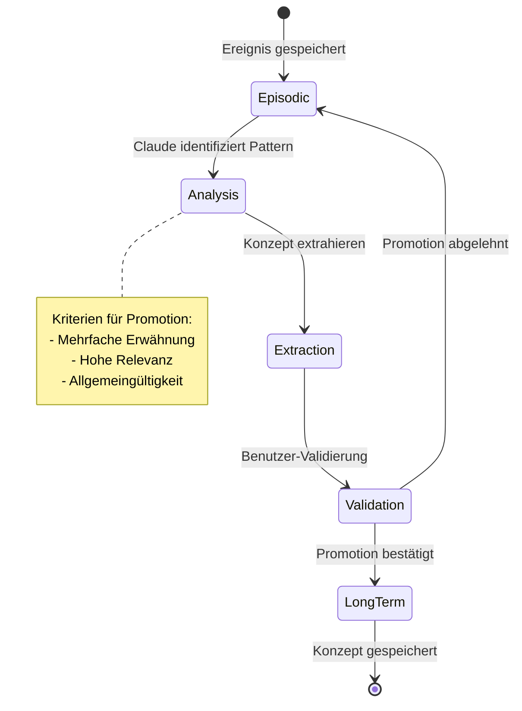
```mermaid
stateDiagram-v2
    [*] --> Episodic: Ereignis gespeichert
    Episodic --> Analysis: Claude identifiziert Pattern
    Analysis --> Extraction: Konzept extrahieren
    Extraction --> Validation: Benutzer-Validierung
    Validation --> LongTerm: Promotion bestätigt
    Validation --> Episodic: Promotion abgelehnt
    LongTerm --> [*]: Konzept gespeichert
    
    note right of Analysis
        Kriterien für Promotion:
        - Mehrfache Erwähnung
        - Hohe Relevanz
        - Allgemeingültigkeit
    end note
```

**Akzeptanzkriterien:**

- Original-Episode bleibt erhalten
- Neues Konzept wird mit Episode verlinkt
- Benutzer kann Promotion manuell auslösen
- Claude kann Promotion vorschlagen

#### FR-008: Memory Consolidation

**Beschreibung:** Das System analysiert Kurzzeitgedächtnis und entscheidet über Archivierung oder Löschung.

**Consolidation-Workflow:**

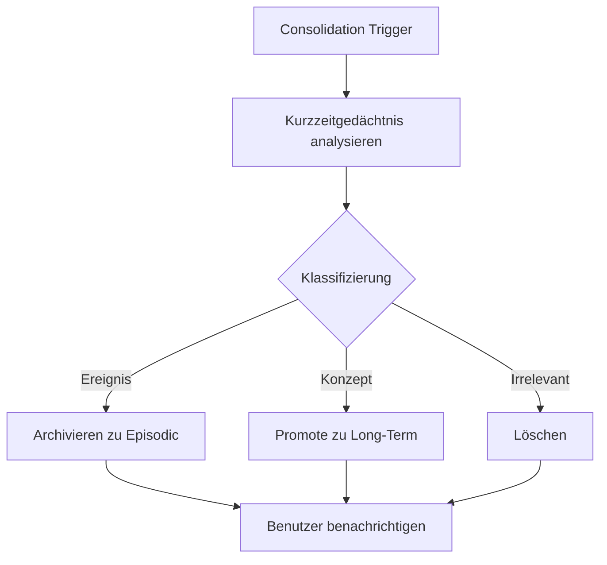
```mermaid
graph TD
    Trigger[Consolidation Trigger]
    Analyze[Kurzzeitgedächtnis analysieren]
    Classify{Klassifizierung}
    Archive[Archivieren zu Episodic]
    Promote[Promote zu Long-Term]
    Delete[Löschen]
    Notify[Benutzer benachrichtigen]
    
    Trigger --> Analyze
    Analyze --> Classify
    Classify -->|Ereignis| Archive
    Classify -->|Konzept| Promote
    Classify -->|Irrelevant| Delete
    Archive --> Notify
    Promote --> Notify
    Delete --> Notify
```

**Trigger:**

- Manuell durch Benutzer
- Automatisch bei Überschreitung der Größenlimits
- Automatisch zu festgelegten Zeiten (täglich, wöchentlich)

**Akzeptanzkriterien:**

- Benutzer erhält Zusammenfassung der Konsolidierung
- Wichtige Items werden nie automatisch gelöscht
- Vorschau vor finaler Konsolidierung möglich

### 3.4 MCP Tool-Spezifikationen

#### Tool-Übersicht

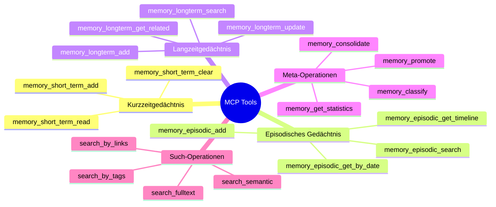
```mermaid
mindmap
    root((MCP Tools))
        Kurzzeitgedächtnis
            memory_short_term_add
            memory_short_term_read
            memory_short_term_clear
        Episodisches Gedächtnis
            memory_episodic_add
            memory_episodic_search
            memory_episodic_get_timeline
            memory_episodic_get_by_date
        Langzeitgedächtnis
            memory_longterm_add
            memory_longterm_search
            memory_longterm_get_related
            memory_longterm_update
        Meta-Operationen
            memory_promote
            memory_consolidate
            memory_classify
            memory_get_statistics
        Such-Operationen
            search_fulltext
            search_semantic
            search_by_tags
            search_by_links
```

#### Tool-Definition: memory_short_term_add

**Zweck:** Hinzufügen von Information zum Kurzzeitgedächtnis

**Parameter:**

- content (string, required): Der zu speichernde Inhalt
- category (enum, optional): ["task", "thought", "reference"]
- priority (enum, optional): ["low", "medium", "high"]

**Rückgabe:**

- success (boolean): Erfolgsstatus
- timestamp (string): ISO 8601 Zeitstempel
- id (string): Eindeutige Identifier

**Fehlerbehandlung:**

- Größenlimit überschritten → automatische Konsolidierung
- Schreibfehler → Retry mit Exponential Backoff

#### Tool-Definition: memory_episodic_add

**Zweck:** Speicherung eines Ereignisses im episodischen Gedächtnis

**Parameter:**

- title (string, required): Titel des Ereignisses
- content (string, required): Detaillierte Beschreibung
- date (string, required): ISO 8601 Datum/Zeit
- tags (array, optional): Liste von Tags
- location (string, optional): Ort des Ereignisses
- participants (array, optional): Beteiligte Personen
- related_episodes (array, optional): Verknüpfte Episoden

**Rückgabe:**

- success (boolean): Erfolgsstatus
- file_path (string): Pfad zur erstellten Datei
- id (string): Eindeutige Identifier
- embedding_queued (boolean): Vektorisierung in Warteschlange

**Fehlerbehandlung:**

- Duplikat-Erkennung → Vorschlag zum Aktualisieren
- Ungültiges Datum → Fehlermeldung mit korrektem Format

#### Tool-Definition: memory_longterm_add

**Zweck:** Speicherung von Langzeitwissen

**Parameter:**

- title (string, required): Titel des Konzepts
- content (string, required): Ausführliche Beschreibung
- category (enum, required): ["concept", "method", "person", "other"]
- tags (array, optional): Liste von Tags
- related_concepts (array, optional): Verknüpfte Konzepte
- sources (array, optional): Quellen/Referenzen

**Rückgabe:**

- success (boolean): Erfolgsstatus
- file_path (string): Pfad zur erstellten Datei
- id (string): Eindeutige Identifier
- backlinks_created (array): Erstellte bidirektionale Links

#### Tool-Definition: memory_promote

**Zweck:** Überführung episodischen Gedächtnisses in Langzeitwissen

**Parameter:**

- episode_id (string, required): ID der Quell-Episode
- concept_title (string, required): Titel des zu extrahierenden Konzepts
- extract_content (string, required): Zu extrahierender Inhalt
- category (enum, required): Kategorie im Langzeitgedächtnis
- keep_episode (boolean, optional, default: true): Original-Episode behalten

**Verarbeitungsschritte:**

1. Episode laden
2. Neues Konzept-Dokument erstellen
3. Bidirektionale Verlinkung aufbauen
4. Metadaten übertragen
5. Vektorisierung triggern

**Rückgabe:**

- success (boolean): Erfolgsstatus
- new_concept_id (string): ID des neuen Konzepts
- link_established (boolean): Verlinkung erfolgreich

#### Tool-Definition: memory_consolidate

**Zweck:** Automatische Analyse und Konsolidierung des Kurzzeitgedächtnisses

**Parameter:**

- auto_execute (boolean, optional, default: false): Automatisch ausführen ohne Bestätigung
- threshold_days (integer, optional, default: 7): Alter in Tagen für Konsolidierung

**Verarbeitungsschritte:**

1. Kurzzeitgedächtnis laden
2. Items nach Alter und Relevanz analysieren
3. Klassifizierung vornehmen
4. Bei auto_execute=false: Vorschlag generieren
5. Bei auto_execute=true: Konsolidierung durchführen

**Rückgabe:**

- items_analyzed (integer): Anzahl analysierter Items
- to_archive (array): Items für episodisches Gedächtnis
- to_promote (array): Items für Langzeitgedächtnis
- to_delete (array): Items zum Löschen
- executed (boolean): Wurde ausgeführt oder nur vorgeschlagen

#### Tool-Definition: search_semantic

**Zweck:** Semantische Suche über Vektor-Ähnlichkeit

**Parameter:**

- query (string, required): Suchanfrage
- scope (enum, optional, default: "all"): ["episodic", "longterm", "all"]
- limit (integer, optional, default: 10): Maximale Anzahl Ergebnisse
- similarity_threshold (float, optional, default: 0.7): Minimale Ähnlichkeit (0-1)
- time_range (object, optional): Zeitfilter für episodische Suche
  - start (string): ISO 8601 Start-Datum
  - end (string): ISO 8601 End-Datum

**Rückgabe:**

- results (array): Liste der Ergebnisse
  - id (string): Dokument-ID
  - title (string): Titel
  - similarity_score (float): Ähnlichkeitswert
  - snippet (string): Relevanter Ausschnitt
  - type (enum): ["episodic", "longterm"]
  - metadata (object): Zusätzliche Metadaten
- total_found (integer): Gesamtanzahl Treffer
- query_embedding_time_ms (integer): Zeit für Query-Embedding
- search_time_ms (integer): Zeit für Vektorsuche

------

## 4. Nicht-Funktionale Anforderungen

### 4.1 Performance-Anforderungen

#### NFR-001: Antwortzeiten

**Anforderungen:**

| Operation                         | Ziel-Latenz | Maximale Latenz |
| --------------------------------- | ----------- | --------------- |
| Kurzzeitgedächtnis Lesen          | < 50ms      | 100ms           |
| Kurzzeitgedächtnis Schreiben      | < 100ms     | 200ms           |
| Episodisches Gedächtnis Erstellen | < 500ms     | 1000ms          |
| Langzeitgedächtnis Erstellen      | < 500ms     | 1000ms          |
| Volltext-Suche                    | < 300ms     | 500ms           |
| Semantische Suche                 | < 150ms     | 300ms           |
| Embedding-Generierung             | < 3s        | 5s              |

**Messverfahren:**

- End-to-End Latenz vom MCP Call bis zur Antwort
- 1. Perzentil als Benchmark
- Messung unter typischer Last (< 10.000 Dokumente)

#### NFR-002: Skalierbarkeit

**Anforderungen:**

| Metrik                     | Minimum | Ziel    |
| -------------------------- | ------- | ------- |
| Anzahl Dokumente gesamt    | 10.000  | 100.000 |
| Episodische Einträge       | 5.000   | 50.000  |
| Langzeit-Konzepte          | 1.000   | 10.000  |
| Vektor-Dimensionen         | 384     | 768     |
| Gleichzeitige MCP Requests | 5       | 20      |

**Strategie:**

- Lazy Loading von Embeddings
- Chunking großer Dokumente
- Batch-Verarbeitung für Vektorisierung
- Indexierung von Metadaten

#### NFR-003: Ressourcenverbrauch

**Limits:**

- RAM-Nutzung: < 2 GB im Idle, < 4 GB unter Last
- CPU-Nutzung: < 10% im Idle, < 50% unter Last
- Festplatten-Nutzung: Wachstum abhängig von Nutzung
- Netzwerk-Nutzung: Nur lokal, kein externes Netz erforderlich

### 4.2 Zuverlässigkeit

#### NFR-004: Verfügbarkeit

**Anforderungen:**

- Uptime: 99.9% während Betriebszeiten
- Automatischer Neustart bei Crashes
- Graceful Degradation bei Teilausfällen

**Degradation-Strategie:**

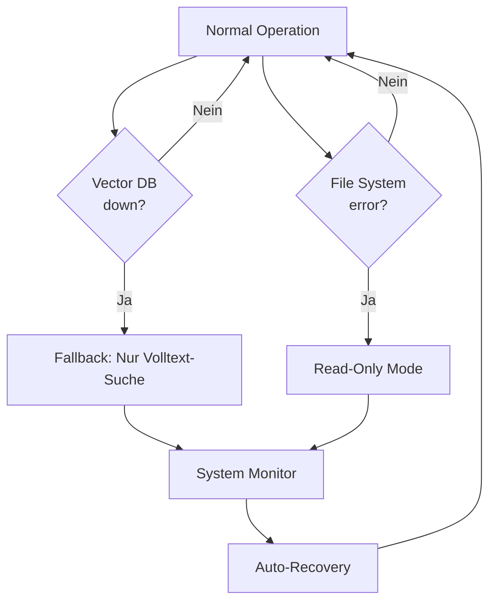
```mermaid
graph TD
    Normal[Normal Operation]
    VectorDown{Vector DB<br/>down?}
    FSDown{File System<br/>error?}
    
    Normal --> VectorDown
    Normal --> FSDown
    
    VectorDown -->|Ja| FallbackFS[Fallback: Nur Volltext-Suche]
    VectorDown -->|Nein| Normal
    
    FSDown -->|Ja| ReadOnly[Read-Only Mode]
    FSDown -->|Nein| Normal
    
    FallbackFS --> Monitor[System Monitor]
    ReadOnly --> Monitor
    Monitor --> Recover[Auto-Recovery]
    Recover --> Normal
```

#### NFR-005: Fehlertoleranz

**Strategien:**

- Automatische Wiederholung bei transienten Fehlern
- Fehlerisolierung: Ein fehlerhaftes Dokument stoppt nicht das System
- Rollback-Mechanismus für fehlgeschlagene Operationen
- Konsistenz-Checks bei Systemstart

**Error Recovery:**

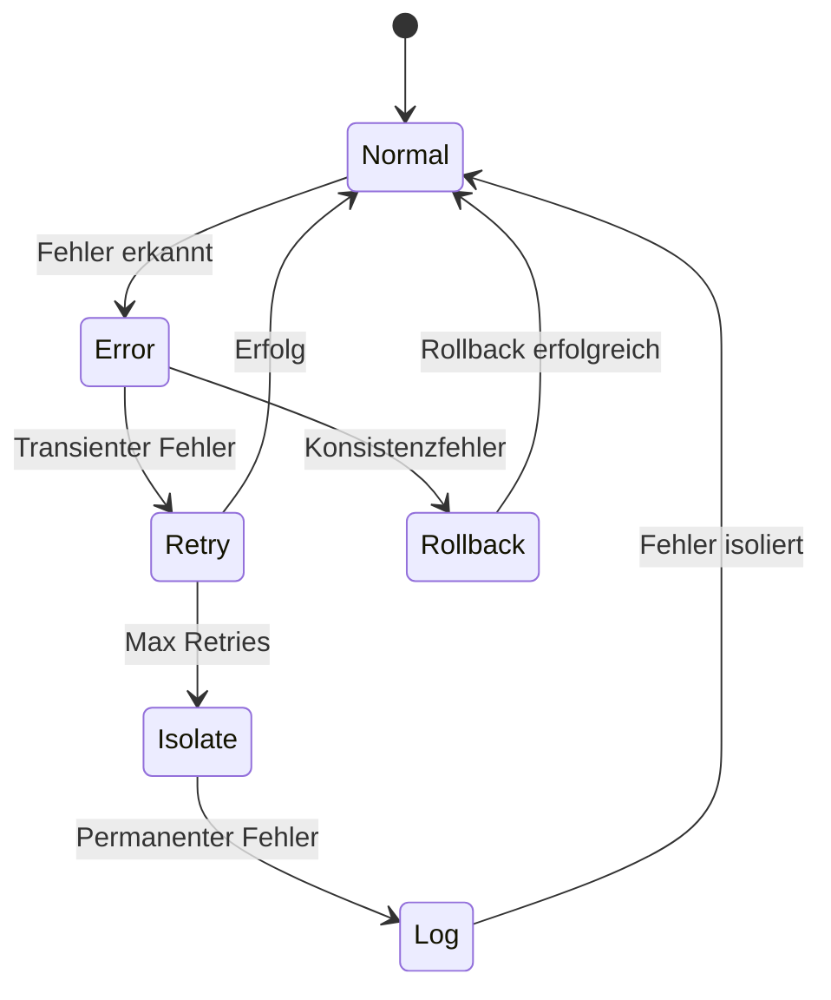
```mermaid
stateDiagram-v2
    [*] --> Normal
    Normal --> Error: Fehler erkannt
    Error --> Retry: Transienter Fehler
    Retry --> Normal: Erfolg
    Retry --> Isolate: Max Retries
    Isolate --> Log: Permanenter Fehler
    Log --> Normal: Fehler isoliert
    Error --> Rollback: Konsistenzfehler
    Rollback --> Normal: Rollback erfolgreich
```

#### NFR-006: Datenintegrität

**Maßnahmen:**

- Atomic File Operations
- Checksums für kritische Dateien
- Regelmäßige Konsistenz-Checks
- Backup-Empfehlungen für Benutzer

**Konsistenz-Garantien:**

- Strong Consistency für Kurzzeitgedächtnis
- Eventual Consistency für Vektorisierung
- Conflict Resolution bei parallelen Schreibvorgängen

### 4.3 Sicherheit und Datenschutz

#### NFR-007: Datensicherheit

**Anforderungen:**

- Alle Daten verbleiben lokal
- Keine Datenübertragung an externe Server (außer optional Embedding-API)
- Betriebssystem-Dateiberechtigungen werden respektiert
- Keine Passwörter oder Credentials im Code

**Security Model:**

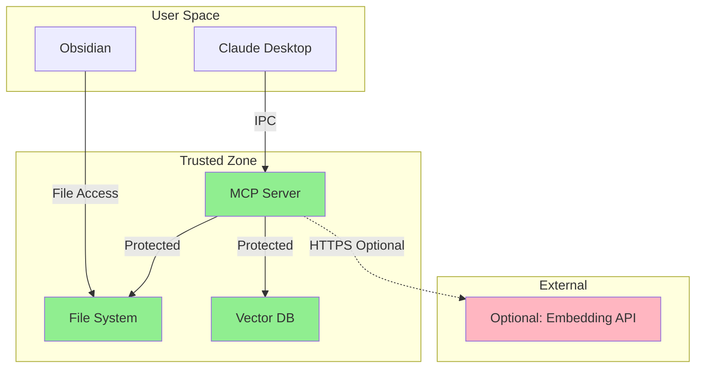
```mermaid
graph TB
    subgraph "Trusted Zone"
        MCP[MCP Server]
        FS[File System]
        VDB[Vector DB]
    end
    
    subgraph "User Space"
        Claude[Claude Desktop]
        Obsidian[Obsidian]
    end
    
    subgraph "External"
        API[Optional: Embedding API]
    end
    
    Claude -->|IPC| MCP
    Obsidian -->|File Access| FS
    MCP -->|Protected| FS
    MCP -->|Protected| VDB
    MCP -.->|HTTPS Optional| API
    
    style MCP fill:#90EE90
    style FS fill:#90EE90
    style VDB fill:#90EE90
    style API fill:#FFB6C1
```

#### NFR-008: Datenschutz

**Prinzipien:**

- Privacy by Design
- Data Minimization: Nur notwendige Metadaten
- Transparenz: Benutzer sieht alle gespeicherten Daten
- Löschbarkeit: Vollständige Entfernung möglich

**GDPR-Compliance:**

- Recht auf Auskunft: Alle Daten in lesbarem Format (Markdown)
- Recht auf Löschung: Manuelle oder automatische Datenlöschung
- Recht auf Datenübertragbarkeit: Standard-Markdown-Format

### 4.4 Wartbarkeit

#### NFR-009: Modularität

**Architekturprinzipien:**

- Loose Coupling zwischen Komponenten
- High Cohesion innerhalb von Modulen
- Klare Schnittstellen über MCP Protocol
- Austauschbarkeit von Komponenten

**Modul-Abhängigkeiten:**

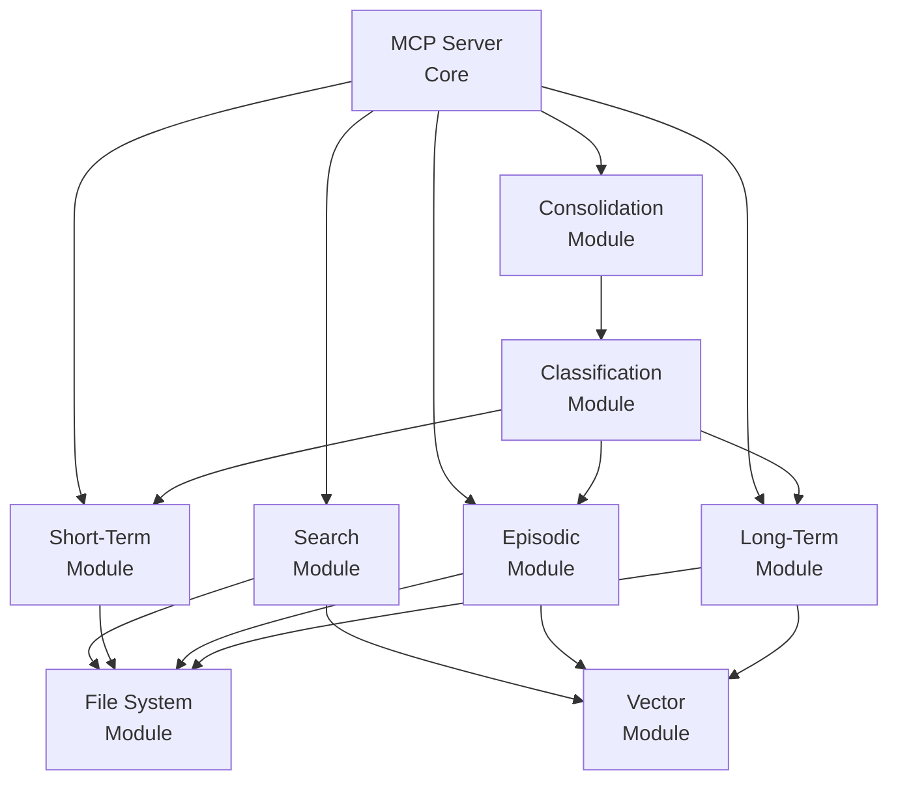
```mermaid
graph TD
    MCP[MCP Server<br/>Core]
    
    STM[Short-Term<br/>Module]
    EPM[Episodic<br/>Module]
    LTM[Long-Term<br/>Module]
    
    Search[Search<br/>Module]
    Vector[Vector<br/>Module]
    FS[File System<br/>Module]
    
    Consolidate[Consolidation<br/>Module]
    Classify[Classification<br/>Module]
    
    MCP --> STM
    MCP --> EPM
    MCP --> LTM
    MCP --> Search
    
    Search --> Vector
    Search --> FS
    
    STM --> FS
    EPM --> FS
    EPM --> Vector
    LTM --> FS
    LTM --> Vector
    
    MCP --> Consolidate
    Consolidate --> Classify
    Classify --> STM
    Classify --> EPM
    Classify --> LTM
```

#### NFR-010: Konfigurierbarkeit

**Konfigurationsebenen:**

1. System-Konfiguration (config.yml)
2. Benutzer-Präferenzen (user-preferences.yml)
3. Runtime-Parameter (MCP Tool Parameters)

**Konfigurierbare Aspekte:**

- Dateipfade und Verzeichnisstruktur
- Vektordatenbank-Einstellungen
- Embedding-Modell und -Parameter
- Konsolidierungs-Regeln
- Performance-Tuning

#### NFR-011: Erweiterbarkeit

**Extension Points:**

- Custom Memory Types
- Custom Classification Rules
- Custom Consolidation Strategies
- Custom Search Algorithms
- Plugin-System für zusätzliche MCP Tools

**Erweiterungsarchitektur:**

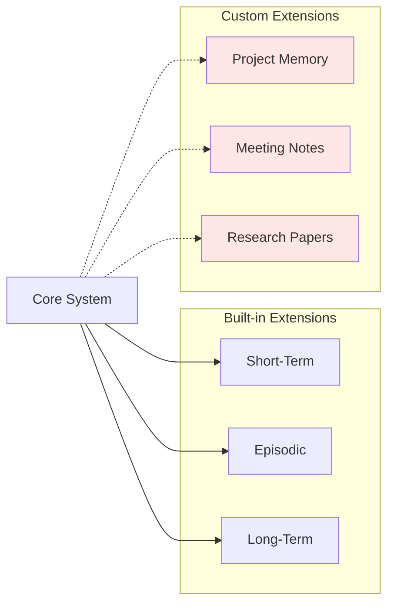
```mermaid
graph LR
    Core[Core System]
    
    subgraph "Built-in Extensions"
        STM[Short-Term]
        EPM[Episodic]
        LTM[Long-Term]
    end
    
    subgraph "Custom Extensions"
        Custom1[Project Memory]
        Custom2[Meeting Notes]
        Custom3[Research Papers]
    end
    
    Core --> STM
    Core --> EPM
    Core --> LTM
    Core -.-> Custom1
    Core -.-> Custom2
    Core -.-> Custom3
    
    style Custom1 fill:#FFE6E6
    style Custom2 fill:#FFE6E6
    style Custom3 fill:#FFE6E6
```

### 4.5 Benutzerfreundlichkeit

#### NFR-012: Transparenz

**Anforderungen:**

- Benutzer versteht, wo Informationen gespeichert werden
- Klassifikations-Entscheidungen sind nachvollziehbar
- Konsolidierungs-Vorschläge sind erklärt
- Fehler werden verständlich kommuniziert

**Feedback-System:**

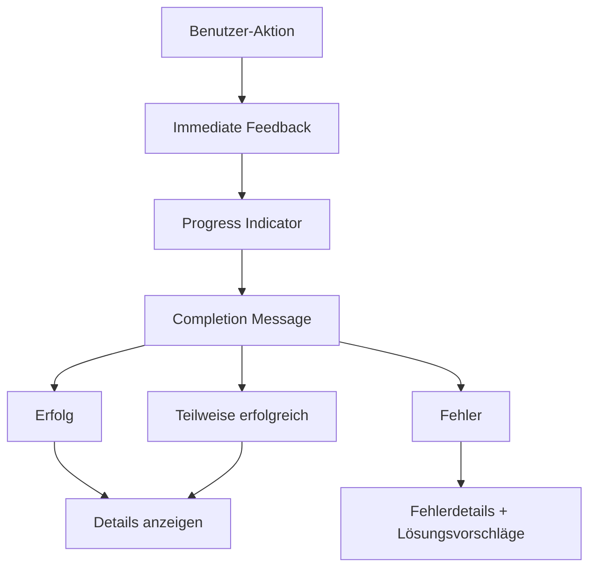
```mermaid
graph TD
    Action[Benutzer-Aktion]
    
    Immediate[Immediate Feedback]
    Progress[Progress Indicator]
    Complete[Completion Message]
    
    Action --> Immediate
    Immediate --> Progress
    Progress --> Complete
    
    Complete --> Success[Erfolg]
    Complete --> PartialSuccess[Teilweise erfolgreich]
    Complete --> Failure[Fehler]
    
    Success --> Detail[Details anzeigen]
    PartialSuccess --> Detail
    Failure --> ErrorDetail[Fehlerdetails + Lösungsvorschläge]
```

#### NFR-013: Konsistenz

**Anforderungen:**

- Einheitliche Namenskonventionen
- Konsistente Dateistrukturen
- Standardisiertes Frontmatter
- Einheitliche Fehlerbehandlung

**Datei-Konventionen:**

- Episodisches Gedächtnis: `YYYY-MM-DD-titel-mit-bindestrichen.md`
- Langzeitgedächtnis: `titel-mit-bindestrichen.md`
- Keine Leerzeichen in Dateinamen
- Kleinschreibung bevorzugt

### 4.6 Interoperabilität

#### NFR-014: Standards-Konformität

**Standards:**

- Model Context Protocol (MCP) Specification
- Markdown: CommonMark Standard
- Frontmatter: YAML Standard
- Timestamps: ISO 8601
- Embeddings: Compatible mit Standard-Modellen

#### NFR-015: Tool-Kompatibilität

**Kompatible Tools:**

- Obsidian (primär)
- VS Code mit Markdown-Plugins
- Standard Markdown-Editoren
- Git für Versionskontrolle
- Standard File System Tools

**Interoperabilitäts-Schichten:**

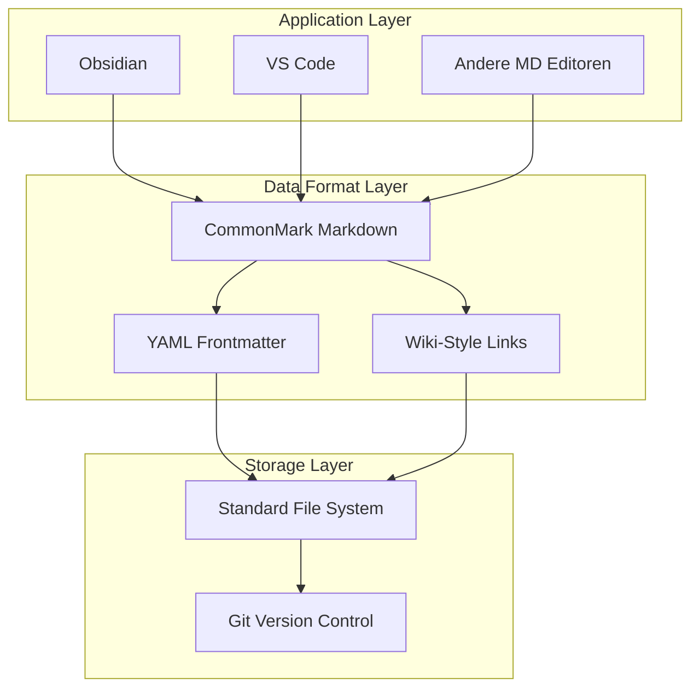
```mermaid
graph TB
    subgraph "Application Layer"
        Obsidian[Obsidian]
        VSCode[VS Code]
        Other[Andere MD Editoren]
    end
    
    subgraph "Data Format Layer"
        Markdown[CommonMark Markdown]
        YAML[YAML Frontmatter]
        WikiLinks[Wiki-Style Links]
    end
    
    subgraph "Storage Layer"
        FileSystem[Standard File System]
        Git[Git Version Control]
    end
    
    Obsidian --> Markdown
    VSCode --> Markdown
    Other --> Markdown
    
    Markdown --> YAML
    Markdown --> WikiLinks
    
    YAML --> FileSystem
    WikiLinks --> FileSystem
    FileSystem --> Git
```

------

## 5. Datenmodell

### 5.1 Gedächtnis-Entitäten

#### Entity: Kurzzeitgedächtnis-Eintrag

**Eigenschaften:**

- timestamp: ISO 8601 DateTime
- content: String (max 2000 Zeichen)
- category: Enum [task, thought, reference]
- priority: Enum [low, medium, high]
- status: Enum [active, archived, deleted]

**Struktur in short-term.md:**

```
## [timestamp] - [category] - [priority]

[content]

---
```

**Lebenszyklus:**

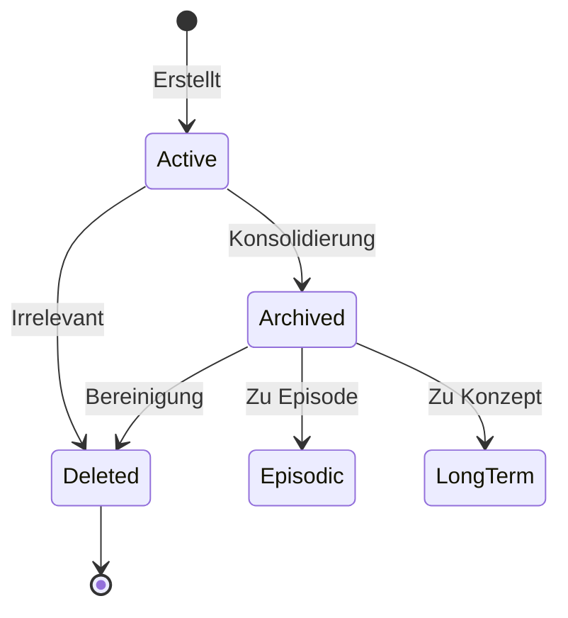
```mermaid
stateDiagram-v2
    [*] --> Active: Erstellt
    Active --> Archived: Konsolidierung
    Active --> Deleted: Irrelevant
    Archived --> Episodic: Zu Episode
    Archived --> LongTerm: Zu Konzept
    Archived --> Deleted: Bereinigung
    Deleted --> [*]
```

#### Entity: Episodisches Gedächtnis (Episode)

**Eigenschaften:**

- id: UUID
- title: String
- date: ISO 8601 DateTime
- content: String (unbegrenzt)
- tags: Array[String]
- location: String (optional)
- participants: Array[String] (optional)
- related_episodes: Array[Episode-ID] (optional)
- created_at: ISO 8601 DateTime
- updated_at: ISO 8601 DateTime

**Frontmatter-Schema:**

```
---
id: [uuid]
title: [titel]
date: [ISO 8601]
tags: [tag1, tag2, tag3]
location: [ort]
participants: [person1, person2]
related_episodes: [episode-id-1, episode-id-2]
created_at: [ISO 8601]
updated_at: [ISO 8601]
---
```

**Beziehungen:**

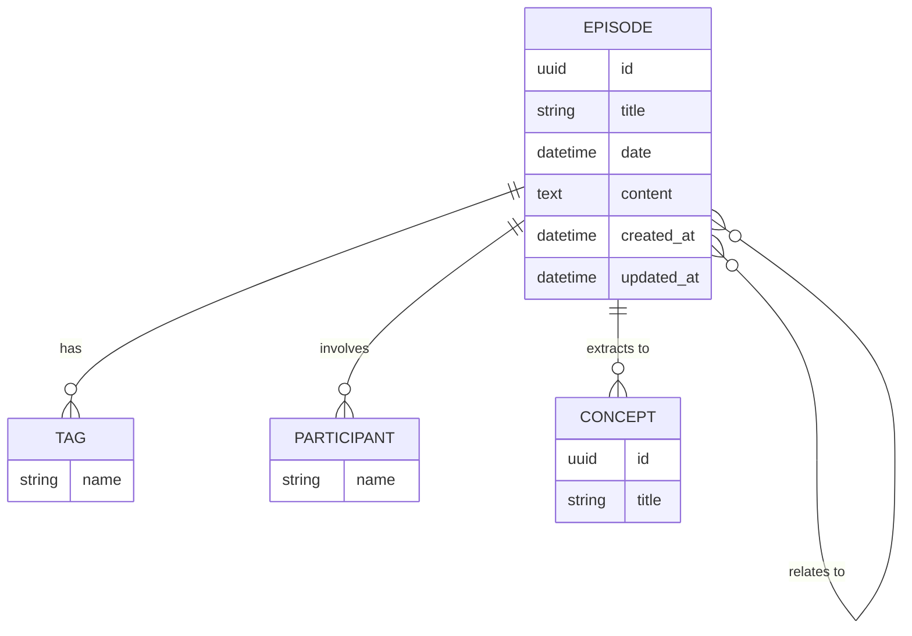
```mermaid
erDiagram
    EPISODE ||--o{ TAG : "has"
    EPISODE ||--o{ PARTICIPANT : "involves"
    EPISODE }o--o{ EPISODE : "relates to"
    EPISODE ||--o{ CONCEPT : "extracts to"
    
    EPISODE {
        uuid id
        string title
        datetime date
        text content
        datetime created_at
        datetime updated_at
    }
    
    TAG {
        string name
    }
    
    PARTICIPANT {
        string name
    }
    
    CONCEPT {
        uuid id
        string title
    }
```

#### Entity: Langzeitgedächtnis (Concept)

**Eigenschaften:**

- id: UUID
- title: String
- content: String (unbegrenzt)
- category: Enum [concept, method, person, other]
- tags: Array[String]
- related_concepts: Array[Concept-ID]
- sources: Array[String] (optional)
- created_at: ISO 8601 DateTime
- updated_at: ISO 8601 DateTime
- version: Integer

**Frontmatter-Schema:**

```
---
id: [uuid]
title: [titel]
category: [concept|method|person|other]
tags: [tag1, tag2, tag3]
related_concepts: [[concept1]], [[concept2]]
sources: [url1, url2]
created_at: [ISO 8601]
updated_at: [ISO 8601]
version: [integer]
---
```

**Konzept-Netzwerk:**

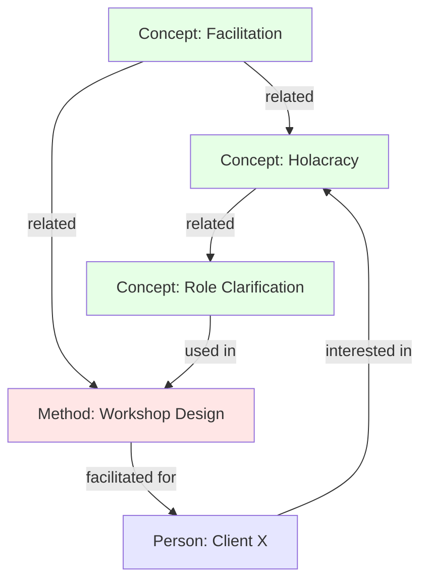
```mermaid
graph TD
    C1[Concept: Facilitation]
    C2[Concept: Holacracy]
    C3[Concept: Role Clarification]
    C4[Method: Workshop Design]
    C5[Person: Client X]
    
    C1 -->|related| C2
    C1 -->|related| C4
    C2 -->|related| C3
    C3 -->|used in| C4
    C4 -->|facilitated for| C5
    C5 -->|interested in| C2
    
    style C1 fill:#E6FFE6
    style C2 fill:#E6FFE6
    style C3 fill:#E6FFE6
    style C4 fill:#FFE6E6
    style C5 fill:#E6E6FF
```

### 5.2 Vektor-Datenbank Schema

#### Collection: episodic_memory

**Schema:**

- vector: Array[Float] (384 oder 768 Dimensionen)
- metadata:
  - id: String (UUID)
  - file_path: String
  - title: String
  - date: String (ISO 8601)
  - tags: Array[String]
  - location: String
  - participants: Array[String]
  - chunk_index: Integer (bei gesplitteten Dokumenten)
  - created_at: String (ISO 8601)

**Indexierung:**

- Primary Index: vector (HNSW oder IVF)
- Secondary Indexes: date, tags

#### Collection: longterm_memory

**Schema:**

- vector: Array[Float] (384 oder 768 Dimensionen)
- metadata:
  - id: String (UUID)
  - file_path: String
  - title: String
  - category: String
  - tags: Array[String]
  - related_concepts: Array[String]
  - chunk_index: Integer (bei gesplitteten Dokumenten)
  - created_at: String (ISO 8601)
  - updated_at: String (ISO 8601)
  - version: Integer

**Indexierung:**

- Primary Index: vector (HNSW oder IVF)
- Secondary Indexes: category, tags

### 5.3 Metadaten-Index

**Zweck:** Schneller Zugriff auf Datei-Metadaten ohne Parsing

**Schema:**

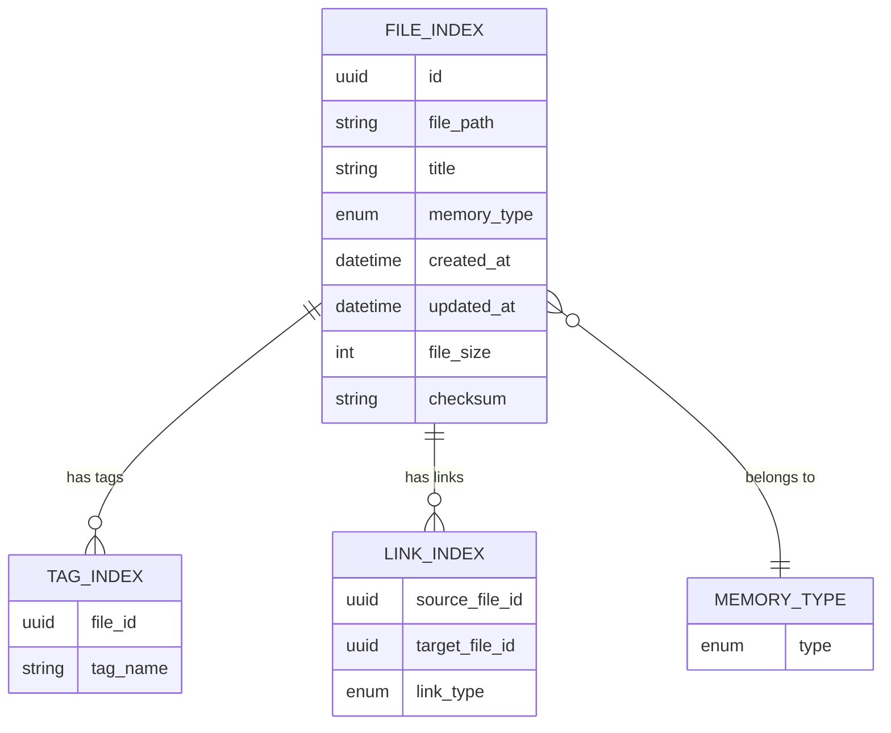
```mermaid
erDiagram
    FILE_INDEX ||--o{ TAG_INDEX : "has tags"
    FILE_INDEX ||--o{ LINK_INDEX : "has links"
    FILE_INDEX }o--|| MEMORY_TYPE : "belongs to"
    
    FILE_INDEX {
        uuid id
        string file_path
        string title
        enum memory_type
        datetime created_at
        datetime updated_at
        int file_size
        string checksum
    }
    
    TAG_INDEX {
        uuid file_id
        string tag_name
    }
    
    LINK_INDEX {
        uuid source_file_id
        uuid target_file_id
        enum link_type
    }
    
    MEMORY_TYPE {
        enum type
    }
```

**Aktualisierung:**

- Bei Dateiänderung durch File Watcher
- Inkrementell, nicht vollständige Neuindexierung
- Konsistenz-Check beim Systemstart

------

## 6. Komponenten-Spezifikation

### 6.1 MCP Server Core

**Verantwortlichkeiten:**

- Empfang und Routing von MCP Tool Calls
- Tool Registry Management
- Error Handling und Response Formatting
- Connection Management mit Claude
- Request Logging

**Schnittstellen:**

```mermaid
graph LR
    Claude[Claude Desktop] -->|MCP Protocol| Server[MCP Server Core]
    Server -->|dispatch| STM[Short-Term Handler]
    Server -->|dispatch| EPM[Episodic Handler]
    Server -->|dispatch| LTM[Long-Term Handler]
    Server -->|dispatch| Search[Search Handler]
    Server -->|dispatch| Meta[Meta Operations]
    
    STM -->|response| Server
    EPM -->|response| Server
    LTM -->|response| Server
    Search -->|response| Server
    Meta -->|response| Server
    
    Server -->|MCP Protocol| Claude
```

**Konfiguration:**

- Server Port (Standard: auto-assign)
- Timeout-Einstellungen
- Rate Limiting
- Logging Level

### 6.2 Memory Manager

**Verantwortlichkeiten:**

- Koordination zwischen den drei Gedächtnisebenen
- Entscheidung über Speicherort basierend auf Klassifikation
- Trigger für Konsolidierung
- Verwaltung von Memory Lifecycle

**Komponenten-Interaktion:**

```mermaid
sequenceDiagram
    participant MCP
    participant Manager as Memory Manager
    participant Classifier
    participant STM as Short-Term
    participant EPM as Episodic
    participant LTM as Long-Term
    
    MCP->>Manager: store_memory(content, context)
    Manager->>Classifier: classify(content, context)
    Classifier->>Classifier: analyze
    Classifier-->>Manager: type: "episodic"
    
    Manager->>EPM: create_episode(content, metadata)
    EPM->>EPM: create markdown file
    EPM->>EPM: trigger embedding
    EPM-->>Manager: success, file_path
    
    Manager-->>MCP: response
```

**Entscheidungslogik:**

```mermaid
graph TD
    Input[Memory Input]
    
    Temporal{Hat zeitlichen<br/>Kontext?}
    Event{Ist spezifisches<br/>Ereignis?}
    Concept{Ist allgemeines<br/>Konzept?}
    Task{Ist aktueller<br/>Task?}
    
    Input --> Temporal
    
    Temporal -->|Ja| Event
    Temporal -->|Nein| Concept
    
    Event -->|Ja| EPM[Episodic Memory]
    Event -->|Nein| Task
    
    Task -->|Ja| STM[Short-Term Memory]
    Task -->|Nein| Concept
    
    Concept -->|Ja| LTM[Long-Term Memory]
    Concept -->|Nein| STM
```

### 6.3 Memory Classifier

**Verantwortlichkeiten:**

- Analyse von Inhalt und Kontext
- Klassifikation in Gedächtnistypen
- Extraktion von Metadaten
- Confidence Scoring

**Klassifikations-Merkmale:**

| Merkmal    | Short-Term        | Episodic           | Long-Term   |
| ---------- | ----------------- | ------------------ | ----------- |
| Zeitbezug  | Aktuell (Stunden) | Spezifisch (Datum) | Zeitlos     |
| Spezifität | Konkret           | Ereignis           | Abstrakt    |
| Persistenz | Flüchtig          | Dauerhaft          | Dauerhaft   |
| Kontext    | Session           | Situativ           | Universal   |
| Relevanz   | Temporär          | Historisch         | Konzeptuell |

**Klassifikations-Algorithmus:**

```mermaid
graph TD
    Start[Input + Context]
    
    CheckDate{Enthält<br/>Datum/Zeit?}
    CheckTask{Task-Keywords?<br/>morgen, heute, etc.}
    CheckEvent{Ereignis-Keywords?<br/>war, hatten, Workshop}
    CheckConcept{Konzept-Keywords?<br/>ist, bedeutet, Prinzip}
    
    Start --> CheckTask
    CheckTask -->|Ja| STM[Short-Term]
    CheckTask -->|Nein| CheckDate
    
    CheckDate -->|Ja| CheckEvent
    CheckDate -->|Nein| CheckConcept
    
    CheckEvent -->|Ja| EPM[Episodic]
    CheckEvent -->|Nein| CheckConcept
    
    CheckConcept -->|Ja| LTM[Long-Term]
    CheckConcept -->|Nein| Default[Default: Episodic]
```

**Metadaten-Extraktion:**

- Zeitangaben (NLP-basiert)
- Personen (Named Entity Recognition)
- Orte (Named Entity Recognition)
- Tags (Keyword-Extraktion)
- Links (Regex-basiert)

### 6.4 File System Handler

**Verantwortlichkeiten:**

- Datei-CRUD-Operationen
- Verzeichnisstruktur-Management
- Frontmatter Parsing und Serialisierung
- Datei-Validierung

**Verzeichnisstruktur:**

```
vault/
├── short-term.md
├── episodes/
│   ├── 2025-01/
│   │   ├── 2025-01-15-workshop-team-x.md
│   │   └── 2025-01-20-meeting-client-y.md
│   └── 2025-02/
│       └── 2025-02-03-conference-facilitation.md
├── concepts/
│   ├── facilitation/
│   │   ├── holacracy.md
│   │   └── workshop-design.md
│   └── technology/
│       └── mcp-protocol.md
├── methods/
│   └── role-clarification-workshop.md
├── people/
│   └── clients/
│       └── client-x.md
└── .system/
    ├── metadata-index.db
    └── config.yml
```

**Datei-Operationen:**

```mermaid
sequenceDiagram
    participant Handler as File System Handler
    participant FS as File System
    participant Validator
    participant Parser as Frontmatter Parser
    
    Handler->>Validator: validate_path(path)
    Validator-->>Handler: valid
    
    Handler->>FS: read_file(path)
    FS-->>Handler: raw_content
    
    Handler->>Parser: parse(raw_content)
    Parser->>Parser: extract frontmatter
    Parser->>Parser: extract body
    Parser-->>Handler: {frontmatter, body}
    
    Handler-->>Handler: return document
```

**Atomare Operationen:**

- Write: Temp-File → Rename (atomic)
- Update: Read → Modify → Write (atomic)
- Delete: Rename to .deleted → Background cleanup

### 6.5 Vector Database Access Layer

**Verantwortlichkeiten:**

- Verbindung zur Vektordatenbank
- Embedding-Generierung
- Vektor-CRUD-Operationen
- Similarity Search

**Architektur:**

```mermaid
graph TB
    subgraph "Application Layer"
        Search[Search Engine]
        MemoryManager[Memory Manager]
    end
    
    subgraph "Vector Access Layer"
        Embedder[Embedding Service]
        VectorOps[Vector Operations]
        CollectionMgr[Collection Manager]
    end
    
    subgraph "Vector Database"
        EpisodicColl[(Episodic Collection)]
        LongtermColl[(Long-term Collection)]
    end
    
    Search --> VectorOps
    MemoryManager --> Embedder
    
    Embedder --> VectorOps
    VectorOps --> CollectionMgr
    
    CollectionMgr --> EpisodicColl
    CollectionMgr --> LongtermColl
```

**Embedding-Pipeline:**

```mermaid
graph LR
    Input[Text Input]
    Preprocess[Preprocessing]
    Chunk[Chunking]
    Model[Embedding Model]
    Vector[Vector Output]
    Store[Store in DB]
    
    Input --> Preprocess
    Preprocess --> Chunk
    Chunk --> Model
    Model --> Vector
    Vector --> Store
    
    style Model fill:#FFE6E6
```

**Chunking-Strategien:**

1. **Kleine Dokumente (< 512 Tokens):**
   - Ein Chunk pro Dokument
   - Gesamter Kontext erhalten
2. **Mittlere Dokumente (512-2048 Tokens):**
   - Split nach Überschriften
   - Überlappung: 50 Tokens
3. **Große Dokumente (> 2048 Tokens):**
   - Sliding Window: 512 Tokens
   - Overlap: 128 Tokens
   - Metadaten für Rekonstruktion

**Similarity Search:**

```mermaid
graph TD
    Query[User Query]
    Embed[Embed Query]
    Search[Vector Search]
    Filter[Apply Filters]
    Rank[Rank Results]
    Retrieve[Retrieve Documents]
    Return[Return to User]
    
    Query --> Embed
    Embed --> Search
    Search --> Filter
    Filter --> Rank
    Rank --> Retrieve
    Retrieve --> Return
```

### 6.6 File Watcher Service

**Verantwortlichkeiten:**

- Überwachung von Dateiänderungen
- Trigger für Re-Embedding
- Metadaten-Index Aktualisierung
- Event Queue Management

**Event-Handling:**

```mermaid
stateDiagram-v2
    [*] --> Watching
    Watching --> FileCreated: Neue Datei
    Watching --> FileModified: Datei geändert
    Watching --> FileDeleted: Datei gelöscht
    
    FileCreated --> QueueEmbedding
    FileModified --> QueueEmbedding
    FileDeleted --> RemoveFromDB
    
    QueueEmbedding --> ProcessingQueue
    ProcessingQueue --> GenerateEmbedding
    GenerateEmbedding --> UpdateVectorDB
    UpdateVectorDB --> UpdateMetadata
    UpdateMetadata --> Watching
    
    RemoveFromDB --> UpdateMetadata
```

**Debouncing:**

- Mehrere schnelle Änderungen → ein Embedding-Job
- Debounce-Zeit: 5 Sekunden (konfigurierbar)
- Batch-Verarbeitung für Performance

**Watched Directories:**

- episodes/ (rekursiv)
- concepts/ (rekursiv)
- methods/ (rekursiv)
- people/ (rekursiv)
- Nicht watched: short-term.md, .system/

### 6.7 Search Engine

**Verantwortlichkeiten:**

- Unified Search Interface
- Kombination von Volltext und Vektor-Suche
- Result Ranking und Deduplication
- Search Query Parsing

**Search-Architektur:**

```mermaid
graph TB
    Query[Search Query]
    Parser[Query Parser]
    
    subgraph "Search Strategies"
        Fulltext[Fulltext Search]
        Semantic[Semantic Search]
        Tag[Tag Search]
        Time[Time-based Search]
    end
    
    Combiner[Result Combiner]
    Ranker[Relevance Ranker]
    Dedup[Deduplicator]
    Results[Final Results]
    
    Query --> Parser
    Parser --> Fulltext
    Parser --> Semantic
    Parser --> Tag
    Parser --> Time
    
    Fulltext --> Combiner
    Semantic --> Combiner
    Tag --> Combiner
    Time --> Combiner
    
    Combiner --> Ranker
    Ranker --> Dedup
    Dedup --> Results
```

**Ranking-Algorithmus:**

```mermaid
graph TD
    Input[Search Results]
    
    Score1[Similarity Score<br/>Weight: 0.4]
    Score2[Keyword Match<br/>Weight: 0.3]
    Score3[Recency<br/>Weight: 0.2]
    Score4[User Preference<br/>Weight: 0.1]
    
    Combine[Combine Scores]
    Sort[Sort by Total]
    Output[Ranked Results]
    
    Input --> Score1
    Input --> Score2
    Input --> Score3
    Input --> Score4
    
    Score1 --> Combine
    Score2 --> Combine
    Score3 --> Combine
    Score4 --> Combine
    
    Combine --> Sort
    Sort --> Output
```

**Query-Typen:**

| Query-Typ  | Beispiel                        | Strategie                  |
| ---------- | ------------------------------- | -------------------------- |
| Einfach    | "Workshop"                      | Fulltext + Semantic        |
| Zeitlich   | "letzte Woche Workshop"         | Time-based + Fulltext      |
| Semantisch | "Wie organisiere ich Teams?"    | Semantic only              |
| Komplex    | "Workshop mit Team X im Januar" | Alle Strategien kombiniert |

### 6.8 Consolidation Engine

**Verantwortlichkeiten:**

- Automatische Analyse von Kurzzeitgedächtnis
- Identifikation von Promotion-Kandidaten
- Duplikat-Erkennung
- Konsolidierungs-Vorschläge

**Konsolidierungs-Pipeline:**

```mermaid
graph TD
    Trigger[Consolidation Trigger]
    Load[Load Short-Term]
    Analyze[Analyze Items]
    
    subgraph "Classification"
        Age[Age Analysis]
        Relevance[Relevance Scoring]
        Pattern[Pattern Detection]
    end
    
    Suggest[Generate Suggestions]
    Review[User Review]
    Execute[Execute Actions]
    
    Trigger --> Load
    Load --> Analyze
    
    Analyze --> Age
    Analyze --> Relevance
    Analyze --> Pattern
    
    Age --> Suggest
    Relevance --> Suggest
    Pattern --> Suggest
    
    Suggest --> Review
    Review -->|Approved| Execute
    Review -->|Rejected| Trigger
```

**Relevance-Scoring:**

```mermaid
graph LR
    Item[Short-Term Item]
    
    Freq[Erwähnungshäufigkeit]
    Age[Alter]
    Links[Verlinkungen]
    Tags[Tags]
    
    Score[Relevance Score]
    Decision{Score > Threshold?}
    
    Item --> Freq
    Item --> Age
    Item --> Links
    Item --> Tags
    
    Freq --> Score
    Age --> Score
    Links --> Score
    Tags --> Score
    
    Score --> Decision
    Decision -->|Ja| Keep[Promote]
    Decision -->|Nein| Delete[Delete]
```

**Pattern Detection:**

- Wiederkehrende Themen
- Zusammenhängende Ereignisse
- Emerging Konzepte
- Duplikate

------

## 7. Prozesse und Workflows

### 7.1 Haupt-Use-Cases

#### Use Case 1: Neue Information speichern

**Akteur:** Claude AI

**Vorbedingung:** MCP Server läuft, Vault ist initialisiert

**Trigger:** Benutzer teilt Information mit Claude

**Hauptablauf:**

```mermaid
sequenceDiagram
    participant User
    participant Claude
    participant MCP
    participant Classifier
    participant MemoryManager
    participant FileSystem
    participant FileWatcher
    participant VectorDB
    
    User->>Claude: "Heute Workshop mit Team X über Rollen"
    Claude->>MCP: memory_add(content, context)
    
    MCP->>Classifier: classify(content, context)
    Classifier->>Classifier: Analyse: Hat Datum, Ereignis
    Classifier-->>MCP: type: "episodic"
    
    MCP->>MemoryManager: store_episodic(content, metadata)
    MemoryManager->>FileSystem: create_file(episode_path)
    FileSystem-->>MemoryManager: file_created
    
    MemoryManager-->>MCP: success, file_id
    MCP-->>Claude: success
    Claude-->>User: "Gespeichert im episodischen Gedächtnis"
    
    Note over FileWatcher: Asynchroner Prozess
    FileWatcher->>FileSystem: detect_change(episode_path)
    FileWatcher->>VectorDB: generate_and_store_embedding()
    VectorDB-->>FileWatcher: embedding_stored
```

**Alternativablauf 1:** Klassifikation unsicher

- System fragt bei Benutzer nach
- Benutzer entscheidet über Speicherort
- Klassifikator lernt aus Entscheidung

**Alternativablauf 2:** Speicherfehler

- System wiederholt Operation (max 3x)
- Bei Fehlschlag: Fehler an Claude melden
- Information geht nicht verloren (Retry-Queue)

#### Use Case 2: Information suchen

**Akteur:** Claude AI

**Vorbedingung:** Vault enthält Daten

**Trigger:** Benutzer stellt Frage, die vergangene Information benötigt

**Hauptablauf:**

```mermaid
sequenceDiagram
    participant User
    participant Claude
    participant MCP
    participant SearchEngine
    participant VectorDB
    participant FileSystem
    
    User->>Claude: "Was haben wir letzten Monat über Holokratie besprochen?"
    Claude->>MCP: search_semantic("Holokratie", time_range, scope="episodic")
    
    MCP->>SearchEngine: execute_search(query, filters)
    
    par Semantic Search
        SearchEngine->>VectorDB: similarity_search(embedding, collection="episodic")
        VectorDB-->>SearchEngine: vector_results
    and Fulltext Search
        SearchEngine->>FileSystem: fulltext_search("Holokratie")
        FileSystem-->>SearchEngine: text_results
    end
    
    SearchEngine->>SearchEngine: combine_and_rank(results)
    SearchEngine-->>MCP: ranked_results
    
    MCP-->>Claude: search_results
    Claude->>Claude: Synthesize answer
    Claude-->>User: "Ihr hattet am 15. Januar einen Workshop..."
```

**Alternativablauf 1:** Keine Ergebnisse

- System schlägt erweiterte Suche vor
- Alternative Suchbegriffe anbieten
- Zeitraum erweitern

**Alternativablauf 2:** Zu viele Ergebnisse

- Automatisches Ranking
- Top 5-10 Ergebnisse zurückgeben
- Möglichkeit zur Verfeinerung anbieten

#### Use Case 3: Memory Consolidation

**Akteur:** System (Scheduler) oder Benutzer

**Vorbedingung:** Kurzzeitgedächtnis enthält Items

**Trigger:** Geplanter Zeitpunkt oder manuelle Anforderung

**Hauptablauf:**

```mermaid
sequenceDiagram
    participant Scheduler
    participant Consolidator
    participant STM as Short-Term
    participant Classifier
    participant User
    participant EPM as Episodic
    participant LTM as Long-Term
    
    Scheduler->>Consolidator: trigger_consolidation()
    Consolidator->>STM: load_all_items()
    STM-->>Consolidator: items
    
    loop For each item
        Consolidator->>Classifier: analyze_item(item)
        Classifier-->>Consolidator: classification + relevance_score
    end
    
    Consolidator->>Consolidator: generate_suggestions()
    Consolidator->>User: show_suggestions()
    User-->>Consolidator: approve_actions()
    
    par Archive to Episodic
        Consolidator->>EPM: create_episodes(items)
    and Promote to Long-Term
        Consolidator->>LTM: create_concepts(items)
    and Delete Irrelevant
        Consolidator->>STM: delete_items(items)
    end
    
    Consolidator->>User: consolidation_complete(summary)
```

**Entscheidungskriterien:**

| Aktion               | Kriterien                                         |
| -------------------- | ------------------------------------------------- |
| Archive to Episodic  | Alter > 3 Tage, Enthält Ereignis, Relevance > 0.5 |
| Promote to Long-Term | Mehrfach erwähnt, Konzeptuell, Relevance > 0.7    |
| Keep in Short-Term   | Alter < 3 Tage, Aktiver Task                      |
| Delete               | Alter > 7 Tage, Relevance < 0.3, Kein Ereignis    |

### 7.2 Systemstart und Initialisierung

**Startup-Sequenz:**

```mermaid
graph TD
    Start[System Start]
    LoadConfig[Load Configuration]
    ValidateVault[Validate Vault Structure]
    InitMCP[Initialize MCP Server]
    InitVectorDB[Initialize Vector DB]
    StartFileWatcher[Start File Watcher]
    ConsistencyCheck[Run Consistency Check]
    Ready[System Ready]
    
    Start --> LoadConfig
    LoadConfig --> ValidateVault
    ValidateVault --> InitMCP
    InitMCP --> InitVectorDB
    InitVectorDB --> StartFileWatcher
    StartFileWatcher --> ConsistencyCheck
    ConsistencyCheck --> Ready
```

**Konsistenz-Check:**

```mermaid
graph TD
    Start[Consistency Check]
    
    CheckFiles[Check File System]
    CheckVectors[Check Vector DB]
    CheckIndex[Check Metadata Index]
    
    Compare[Compare States]
    Issues{Issues found?}
    
    Repair[Repair Inconsistencies]
    Report[Generate Report]
    Complete[Check Complete]
    
    Start --> CheckFiles
    Start --> CheckVectors
    Start --> CheckIndex
    
    CheckFiles --> Compare
    CheckVectors --> Compare
    CheckIndex --> Compare
    
    Compare --> Issues
    Issues -->|Yes| Repair
    Issues -->|No| Report
    Repair --> Report
    Report --> Complete
```

**Recovery-Strategien:**

- Fehlende Embeddings: Re-queue für Generierung
- Orphaned Vectors: Entfernen aus Datenbank
- Beschädigte Dateien: Quarantäne und Benachrichtigung
- Index-Inkonsistenzen: Rebuild Index

### 7.3 Fehlerbehandlung

**Fehler-Kategorien:**

```mermaid
graph TD
    Error[Error Detected]
    
    Type{Error Type}
    
    Transient[Transient Error]
    Permanent[Permanent Error]
    Critical[Critical Error]
    
    Type -->|Temporary| Transient
    Type -->|Permanent| Permanent
    Type -->|System| Critical
    
    Transient --> Retry[Retry Logic]
    Retry --> Success{Success?}
    Success -->|Yes| Resolve[Resolved]
    Success -->|No| Escalate[Escalate to Permanent]
    
    Permanent --> Log[Log Error]
    Log --> Notify[Notify User]
    Notify --> Degrade[Graceful Degradation]
    
    Critical --> Emergency[Emergency Shutdown]
    Emergency --> SafeState[Save State]
    SafeState --> Alert[Alert User]
```

**Retry-Logik:**

- Exponential Backoff: 1s, 2s, 4s, 8s
- Max Retries: 3
- Jitter: ±20% für Collision Avoidance

**Graceful Degradation:**

```mermaid
graph LR
    Normal[Normal Operation]
    
    VectorFail[Vector DB Failed]
    FSFail[File System Issues]
    
    Degraded1[Fulltext Only Mode]
    Degraded2[Read-Only Mode]
    
    Normal --> VectorFail
    Normal --> FSFail
    
    VectorFail --> Degraded1
    FSFail --> Degraded2
    
    Degraded1 -.->|Recovery| Normal
    Degraded2 -.->|Recovery| Normal
```

### 7.4 Backup und Recovery

**Backup-Strategie:**

```mermaid
graph TD
    Data[User Data]
    
    Markdown[Markdown Files]
    VectorDB[Vector Database]
    MetadataIndex[Metadata Index]
    Config[Configuration]
    
    Data --> Markdown
    Data --> VectorDB
    Data --> MetadataIndex
    Data --> Config
    
    Markdown --> Git[Git Versioning]
    VectorDB --> Snapshot[DB Snapshot]
    MetadataIndex --> Rebuild[Can be Rebuilt]
    Config --> GitConfig[Git Versioning]
    
    Git --> UserBackup[User's Backup System]
    Snapshot --> UserBackup
    GitConfig --> UserBackup
```

**Empfohlene Backup-Praxis:**

1. Git-Repository für Markdown-Files
2. Regelmäßige Commits (automatisch oder manuell)
3. Remote-Backup (private Git-Server oder verschlüsselte Cloud)
4. Vector DB Snapshots wöchentlich
5. Metadata Index ist rebuildable, kein Backup nötig

**Recovery-Prozess:**

```mermaid
graph TD
    Disaster[Data Loss Detected]
    
    RestoreMarkdown[Restore Markdown from Git]
    RestoreVectorDB[Restore Vector DB from Snapshot]
    RebuildIndex[Rebuild Metadata Index]
    
    ReEmbed{Need Re-embedding?}
    
    GenerateEmbeddings[Generate Missing Embeddings]
    VerifyConsistency[Verify Consistency]
    SystemReady[System Ready]
    
    Disaster --> RestoreMarkdown
    RestoreMarkdown --> RestoreVectorDB
    RestoreVectorDB --> RebuildIndex
    
    RebuildIndex --> ReEmbed
    ReEmbed -->|Yes| GenerateEmbeddings
    ReEmbed -->|No| VerifyConsistency
    
    GenerateEmbeddings --> VerifyConsistency
    VerifyConsistency --> SystemReady
```

------

## 8. Technologie-Stack Empfehlungen

### 8.1 MCP Server

**Empfohlene Technologien:**

- **Sprache:** TypeScript oder Python
- **Framework:** Node.js (für TypeScript) oder FastAPI (für Python)
- **MCP SDK:** @modelcontextprotocol/sdk (für TypeScript)

**Begründung:**

- TypeScript: Gute MCP-SDK Unterstützung, Type Safety
- Python: Exzellentes Ökosystem für ML/NLP, einfacher für Embedding-Integration

**Alternative:** Go für höchste Performance bei sehr großen Vaults

### 8.2 Vektordatenbank

**Empfehlung: Chroma (für den Start)**

**Eigenschaften:**

- Einfache Installation und Setup
- Gute Python/TypeScript Clients
- Embedded Mode für lokalen Betrieb
- Open Source

**Alternative Optionen:**

| Datenbank | Vorteile                 | Nachteile           | Geeignet für          |
| --------- | ------------------------ | ------------------- | --------------------- |
| Chroma    | Einfach, Embedded        | Weniger Features    | Start, < 100k Docs    |
| Qdrant    | Performant, Features     | Komplexer Setup     | > 100k Docs           |
| Weaviate  | Skalierbar, Cloud-Option | Overhead            | Enterprise            |
| LanceDB   | Sehr leicht, Columnar    | Neu, weniger mature | Embedded, Performance |

### 8.3 Embedding-Modell

**Empfehlung: sentence-transformers/all-MiniLM-L6-v2**

**Eigenschaften:**

- Dimensionen: 384
- Schnell (~ 100ms für 512 Tokens)
- Gute Qualität für deutsche und englische Texte
- Kann lokal laufen (keine API-Kosten)
- Moderate Modell-Größe (~ 80 MB)

**Alternative Optionen:**

| Modell                        | Dimensionen | Geschwindigkeit | Qualität  | Größe       |
| ----------------------------- | ----------- | --------------- | --------- | ----------- |
| all-MiniLM-L6-v2              | 384         | Sehr schnell    | Gut       | 80 MB       |
| all-mpnet-base-v2             | 768         | Schnell         | Sehr gut  | 420 MB      |
| multilingual-e5-large         | 1024        | Mittel          | Exzellent | 2.2 GB      |
| OpenAI text-embedding-3-small | 1536        | API             | Exzellent | API-basiert |

**Entscheidungskriterien:**

- Lokaler Betrieb bevorzugt: MiniLM oder mpnet
- Beste Qualität: multilingual-e5-large
- API-Option akzeptabel: OpenAI (Kosten, Datenschutz beachten)

### 8.4 File System Watcher

**Empfehlung: chokidar (Node.js) oder watchdog (Python)**

**Eigenschaften:**

- Plattformübergreifend
- Effizient (OS-native APIs)
- Debouncing eingebaut
- Stabil und gut getestet

### 8.5 Markdown Processing

**Empfehlung: remark / unified (Node.js) oder python-markdown (Python)**

**Anforderungen:**

- YAML Frontmatter Parsing
- Wiki-Link Erkennung [[link]]
- CommonMark Compliance
- AST-Manipulation für Extraktion

### 8.6 Development und Testing

**Empfehlungen:**

- **Version Control:** Git
- **Testing Framework:** Jest (TypeScript) oder pytest (Python)
- **Linting:** ESLint (TypeScript) oder pylint (Python)
- **Formatting:** Prettier (TypeScript) oder black (Python)
- **Documentation:** TypeDoc (TypeScript) oder Sphinx (Python)

### 8.7 Deployment

**Empfehlung: Systemd Service (Linux) oder LaunchAgent (macOS)**

**Anforderungen:**

- Auto-Start beim Systemstart
- Automatic Restart bei Crashes
- Logging über systemd/launchd
- Einfache Start/Stop Commands

**Windows:** Windows Service oder Task Scheduler

------

## 9. Qualitätssicherung

### 9.1 Testing-Strategie

**Test-Pyramide:**

```mermaid
graph TD
    subgraph "Test Levels"
        E2E[End-to-End Tests<br/>10%]
        Integration[Integration Tests<br/>30%]
        Unit[Unit Tests<br/>60%]
    end
    
    E2E --> Integration
    Integration --> Unit
    
    style E2E fill:#FFE6E6
    style Integration fill:#FFE6B3
    style Unit fill:#E6FFE6
```

#### Unit Tests

**Umfang:**

- Alle Business Logic Komponenten
- Memory Classifier
- Search Engine Algorithmen
- File System Handler
- Utility Functions

**Abdeckungsziel:** > 80%

**Beispiel-Testfälle:**

- Memory Classifier klassifiziert korrekt
- Frontmatter Parser erkennt alle Felder
- Similarity Search rankt korrekt
- Consolidator erkennt Duplikate

#### Integration Tests

**Umfang:**

- MCP Server <-> Memory Manager
- File System <-> Vector Database
- Search Engine <-> Beide Storage Layer
- File Watcher <-> Embedding Service

**Testszenarien:**

- Vollständiger Memory Storage Workflow
- Suche über verschiedene Ebenen
- Consolidation mit Promotion
- Fehlerbehandlung bei DB-Ausfall

#### End-to-End Tests

**Umfang:**

- Komplette User Journeys
- Claude Integration
- Obsidian Interoperabilität

**Testszenarien:**

- Neue Information speichern und später finden
- Episode zu Konzept promoten
- Kurzzeitgedächtnis konsolidieren
- Systemstart nach Crash

### 9.2 Performance Testing

**Metriken:**

```mermaid
graph LR
    Latency[Latency]
    Throughput[Throughput]
    ResourceUsage[Resource Usage]
    
    Latency --> P50[P50]
    Latency --> P95[P95]
    Latency --> P99[P99]
    
    Throughput --> RPS[Requests/sec]
    Throughput --> OPS[Operations/sec]
    
    ResourceUsage --> CPU[CPU %]
    ResourceUsage --> Memory[Memory MB]
    ResourceUsage --> Disk[Disk I/O]
```

**Lastszenarien:**

| Szenario    | Dokumente | Operationen/sec | Dauer | Ziel           |
| ----------- | --------- | --------------- | ----- | -------------- |
| Light Load  | 1.000     | 5               | 1h    | Baseline       |
| Normal Load | 10.000    | 10              | 4h    | Typical Usage  |
| Heavy Load  | 50.000    | 20              | 1h    | Stress Test    |
| Peak Load   | 100.000   | 50              | 10min | Burst Capacity |

**Acceptance Criteria:**

- P95 Latency bleibt unter definierten Limits
- Memory Usage steigt nicht kontinuierlich (kein Memory Leak)
- System bleibt stabil unter Heavy Load

### 9.3 Security Testing

**Testbereiche:**

- Input Validation (keine Injection-Angriffe)
- Path Traversal Prevention
- Rate Limiting Effectiveness
- Permission Checks

**Automated Security Scanning:**

- Dependency Vulnerability Scanning (npm audit / safety)
- Static Code Analysis (SonarQube)
- SAST Tools

### 9.4 Usability Testing

**Testfragen:**

- Ist die Gedächtnis-Klassifikation nachvollziehbar?
- Sind Fehler-Nachrichten hilfreich?
- Sind Konsolidierungs-Vorschläge sinnvoll?
- Ist die Suche intuitiv?

**Feedback-Mechanismen:**

- Beta-Tester Feedback
- Usage Analytics (lokal, opt-in)
- Error Reports mit Kontext

------

## 10. Deployment und Betrieb

### 10.1 Installation

**Installationsprozess:**

```mermaid
graph TD
    Start[Installation Start]
    
    InstallDeps[Install Dependencies]
    SetupVault[Setup Vault Directory]
    InitVectorDB[Initialize Vector DB]
    ConfigureMCP[Configure MCP]
    DownloadModel[Download Embedding Model]
    CreateConfig[Create Configuration Files]
    FirstRun[First Run & Validation]
    Complete[Installation Complete]
    
    Start --> InstallDeps
    InstallDeps --> SetupVault
    SetupVault --> InitVectorDB
    InitVectorDB --> ConfigureMCP
    ConfigureMCP --> DownloadModel
    DownloadModel --> CreateConfig
    CreateConfig --> FirstRun
    FirstRun --> Complete
```

**Voraussetzungen:**

- Betriebssystem: Linux, macOS, oder Windows
- Node.js >= 18 oder Python >= 3.9
- 4 GB RAM empfohlen
- 2 GB freier Festplattenspeicher

**Installation via Package Manager (Zukünftig):**

```
npm install -g digital-memory-system
```

oder

```
pip install digital-memory-system
```

**Manuelle Installation:**

1. Repository klonen
2. Dependencies installieren
3. Setup-Script ausführen
4. Konfiguration anpassen
5. Service starten

### 10.2 Konfiguration

**Konfigurationsdatei: config.yml**

**Struktur:**

```yaml
vault:
  path: /path/to/vault
  structure:
    short_term: short-term.md
    episodic_dir: episodes
    longterm_dirs:
      - concepts
      - methods
      - people

mcp:
  server:
    port: auto
    timeout: 30000
  tools:
    enabled: all

vector_db:
  type: chroma
  path: .system/vectordb
  collections:
    episodic:
      distance: cosine
    longterm:
      distance: cosine

embedding:
  model: sentence-transformers/all-MiniLM-L6-v2
  device: cpu
  batch_size: 32

file_watcher:
  enabled: true
  debounce_ms: 5000
  ignore_patterns:
    - "*.tmp"
    - ".DS_Store"

consolidation:
  auto_trigger: true
  schedule: "0 2 * * *"  # Daily at 2 AM
  short_term_max_age_days: 7
  relevance_threshold: 0.3

logging:
  level: info
  file: .system/logs/system.log
  max_size_mb: 100
  max_files: 10
```

**Umgebungsvariablen:**

- `MEMORY_VAULT_PATH`: Überschreibt vault.path
- `MEMORY_LOG_LEVEL`: Überschreibt logging.level
- `MEMORY_EMBEDDING_DEVICE`: cpu oder cuda

### 10.3 Betrieb als Service

**Systemd Service (Linux):**

**Service-Datei: `/etc/systemd/system/digital-memory.service`**

```
[Unit]
Description=Digital Memory System
After=network.target

[Service]
Type=simple
User=<username>
WorkingDirectory=/path/to/installation
ExecStart=/usr/local/bin/digital-memory-server
Restart=always
RestartSec=10
Environment="MEMORY_VAULT_PATH=/path/to/vault"

[Install]
WantedBy=multi-user.target
```

**Management Commands:**

```
systemctl start digital-memory
systemctl stop digital-memory
systemctl restart digital-memory
systemctl status digital-memory
systemctl enable digital-memory
```

**LaunchAgent (macOS):**

**Plist-Datei: `~/Library/LaunchAgents/com.user.digital-memory.plist`**

```xml
<?xml version="1.0" encoding="UTF-8"?>
<!DOCTYPE plist PUBLIC "-//Apple//DTD PLIST 1.0//EN">
<plist version="1.0">
<dict>
    <key>Label</key>
    <string>com.user.digital-memory</string>
    <key>ProgramArguments</key>
    <array>
        <string>/usr/local/bin/digital-memory-server</string>
    </array>
    <key>RunAtLoad</key>
    <true/>
    <key>KeepAlive</key>
    <true/>
</dict>
</plist>
```

### 10.4 Monitoring

**Metriken:**

| Kategorie   | Metrik              | Alert Threshold  |
| ----------- | ------------------- | ---------------- |
| Performance | P95 Latency         | > 500ms          |
| Performance | Request Rate        | > 100 req/s      |
| Resources   | Memory Usage        | > 4 GB           |
| Resources   | CPU Usage           | > 80% for > 5min |
| Health      | Error Rate          | > 5%             |
| Health      | Vector DB Status    | Offline          |
| Data        | Vault Size          | > 10 GB          |
| Data        | Items in Short-Term | > 1000           |

**Monitoring-Dashboard:**

```mermaid
graph TB
    subgraph "System Health"
        Status[Service Status]
        Uptime[Uptime]
        Errors[Error Count]
    end
    
    subgraph "Performance"
        Latency[Avg Latency]
        Throughput[Requests/sec]
        QueueDepth[Embedding Queue]
    end
    
    subgraph "Resources"
        CPU[CPU Usage]
        Memory[Memory Usage]
        Disk[Disk Usage]
    end
    
    subgraph "Data"
        TotalDocs[Total Documents]
        STMCount[Short-Term Items]
        EPMCount[Episodes]
        LTMCount[Concepts]
    end
```

**Logging-Strategie:**

| Level | Verwendung           | Beispiele                               |
| ----- | -------------------- | --------------------------------------- |
| ERROR | System-Fehler        | DB Connection Failed, File I/O Error    |
| WARN  | Potentielle Probleme | High Memory Usage, Slow Query           |
| INFO  | Wichtige Events      | Service Started, Consolidation Complete |
| DEBUG | Detaillierte Info    | Request Details, Cache Hits             |
| TRACE | Sehr detailliert     | Function Calls, Variable Values         |

**Log-Format (strukturiert):**

```json
{
  "timestamp": "2025-01-15T10:30:45.123Z",
  "level": "INFO",
  "component": "MemoryManager",
  "message": "Episode created successfully",
  "metadata": {
    "episode_id": "abc-123",
    "file_path": "episodes/2025-01/2025-01-15-workshop.md",
    "duration_ms": 245
  }
}
```

### 10.5 Wartung

**Regelmäßige Aufgaben:**

| Aufgabe                | Frequenz    | Beschreibung           |
| ---------------------- | ----------- | ---------------------- |
| Backup                 | Täglich     | Vault Snapshot         |
| Vector DB Optimization | Wöchentlich | Index Rebuilding       |
| Log Rotation           | Täglich     | Alte Logs archivieren  |
| Consistency Check      | Wöchentlich | Datenintegrität prüfen |
| Dependency Updates     | Monatlich   | Security Updates       |
| Performance Review     | Monatlich   | Metrics analysieren    |

**Wartungsfenster:**

- Bevorzugt: Nachts (2-4 Uhr)
- Dauer: < 30 Minuten
- Downtime: Nicht erforderlich (Graceful Degradation)

**Update-Prozess:**

```mermaid
graph TD
    Check[Check for Updates]
    Backup[Create Backup]
    Stop[Stop Service]
    Update[Install Update]
    Migrate[Run Migrations]
    Test[Test System]
    Start[Start Service]
    Verify[Verify Operation]
    
    Check --> Backup
    Backup --> Stop
    Stop --> Update
    Update --> Migrate
    Migrate --> Test
    Test --> Start
    Start --> Verify
```

------

## 11. Migration und Skalierung

### 11.1 Datenmigration

**Von anderen Systemen:**

```mermaid
graph LR
    Source[Source System]
    Extract[Extract Data]
    Transform[Transform to Markdown]
    Validate[Validate Structure]
    Import[Import to Vault]
    Index[Generate Embeddings]
    Verify[Verify Completeness]
    
    Source --> Extract
    Extract --> Transform
    Transform --> Validate
    Validate --> Import
    Import --> Index
    Index --> Verify
```

**Unterstützte Quellen (zukünftig):**

- Notion Export
- Evernote Export
- Roam Research JSON
- Standard Markdown Directories
- Plain Text Files

**Transformations-Regeln:**

- Datum-Extraktion für Episoden
- Tag-Normalisierung
- Link-Umwandlung zu Wiki-Links
- Metadaten-Mapping

### 11.2 Skalierungsstrategie

**Vertikale Skalierung:**

| Wachstum   | RAM   | CPU      | Storage | Vector DB   |
| ---------- | ----- | -------- | ------- | ----------- |
| < 10k Docs | 2 GB  | 2 Cores  | 5 GB    | Embedded    |
| 10k-50k    | 4 GB  | 4 Cores  | 20 GB   | Standalone  |
| 50k-100k   | 8 GB  | 6 Cores  | 50 GB   | Optimized   |
| > 100k     | 16 GB | 8+ Cores | 100+ GB | Distributed |

**Horizontale Skalierung (bei Bedarf):**

```mermaid
graph TB
    subgraph "Client Layer"
        Client1[Claude Instance 1]
        Client2[Claude Instance 2]
    end
    
    subgraph "Service Layer"
        LB[Load Balancer]
        MCP1[MCP Server 1]
        MCP2[MCP Server 2]
    end
    
    subgraph "Data Layer"
        SharedFS[Shared File System]
        VectorCluster[Vector DB Cluster]
    end
    
    Client1 --> LB
    Client2 --> LB
    
    LB --> MCP1
    LB --> MCP2
    
    MCP1 --> SharedFS
    MCP2 --> SharedFS
    
    MCP1 --> VectorCluster
    MCP2 --> VectorCluster
```

**Optimization Techniques:**

- Lazy Loading von Embeddings
- Caching häufiger Queries
- Batch-Processing
- Asynchrone Operationen
- Query Result Caching

### 11.3 Performance-Optimierung

**Optimization-Bereiche:**

| Bereich       | Technik                    | Erwarteter Gewinn           |
| ------------- | -------------------------- | --------------------------- |
| Embedding     | Batch Processing           | 3-5x schneller              |
| Search        | Result Caching             | 10x schneller bei Cache-Hit |
| File I/O      | Memory-Mapped Files        | 2x schneller                |
| Vector Search | Index Tuning (HNSW params) | 2-3x schneller              |
| Metadata      | In-Memory Index            | 10-20x schneller            |

**Caching-Strategie:**

```mermaid
graph TD
    Request[Search Request]
    CacheCheck{In Cache?}
    Cache[Return from Cache]
    Execute[Execute Search]
    Store[Store in Cache]
    Return[Return Results]
    
    Request --> CacheCheck
    CacheCheck -->|Yes| Cache
    CacheCheck -->|No| Execute
    Execute --> Store
    Store --> Return
    Cache --> Return
```

**Cache-Konfiguration:**

- TTL: 5 Minuten für Suchergebnisse
- Max Size: 1000 Entries
- Eviction: LRU (Least Recently Used)
- Invalidation: Bei Datei-Änderungen

------

## 12. Erweiterbarkeit und Zukunft

### 12.1 Plugin-System

**Plugin-Architektur:**

```mermaid
graph TB
    Core[Core System]
    
    subgraph "Plugin Interface"
        Hooks[Event Hooks]
        API[Plugin API]
        Registry[Plugin Registry]
    end
    
    subgraph "Example Plugins"
        P1[Auto-Tagging Plugin]
        P2[Summary Generator]
        P3[External Sync]
        P4[Custom Embedding]
    end
    
    Core --> Hooks
    Core --> API
    Core --> Registry
    
    Hooks --> P1
    Hooks --> P2
    API --> P3
    API --> P4
```

**Plugin-Hooks:**

- pre_store: Vor dem Speichern
- post_store: Nach dem Speichern
- pre_search: Vor der Suche
- post_search: Nach der Suche
- consolidation: Während Konsolidierung
- classification: Bei Klassifikation

**Beispiel-Plugins:**

1. **Auto-Tagging Plugin:**
   - Automatische Tag-Generierung via NLP
   - Konsistente Tag-Vorschläge
2. **Summary Generator:**
   - Automatische Zusammenfassungen für lange Episoden
   - LLM-basierte Extraktion
3. **External Sync:**
   - Sync mit Cloud-Services
   - Webhook-Integrationen
4. **Custom Classifiers:**
   - Domain-spezifische Klassifikations-Regeln
   - Machine Learning basierte Klassifikation

### 12.2 Zukünftige Features

**Roadmap:**

```mermaid
gantt
    title Digital Memory System Roadmap
    dateFormat YYYY-MM-DD
    section Phase 1
    Core System                :done, 2025-01-01, 2025-03-31
    Basic MCP Integration      :done, 2025-01-15, 2025-03-31
    Vector Search             :done, 2025-02-01, 2025-03-31
    
    section Phase 2
    Plugin System             :active, 2025-04-01, 2025-06-30
    Advanced Search           :2025-04-15, 2025-06-30
    Auto-Tagging             :2025-05-01, 2025-06-30
    
    section Phase 3
    Multi-User Support       :2025-07-01, 2025-09-30
    Cloud Sync              :2025-07-15, 2025-09-30
    Mobile Support          :2025-08-01, 2025-09-30
    
    section Phase 4
    AI Insights             :2025-10-01, 2025-12-31
    Knowledge Graph         :2025-10-15, 2025-12-31
    Advanced Analytics      :2025-11-01, 2025-12-31
```

**Feature-Details:**

**Phase 2 (Q2 2025):**

- Plugin System für Erweiterbarkeit
- Advanced Search (Boolean, Proximity)
- Auto-Tagging mit NLP

**Phase 3 (Q3 2025):**

- Multi-User/Team-Funktionalität
- Optionale Cloud-Synchronisation
- Mobile Apps (iOS/Android)

**Phase 4 (Q4 2025):**

- AI-basierte Insights ("Was habe ich gelernt?")
- Knowledge Graph Visualisierung
- Analytics Dashboard

### 12.3 Community und Open Source

**Contribution-Bereiche:**

- Core System Entwicklung
- Plugin-Entwicklung
- Dokumentation
- Testing
- Übersetzungen

**Governance:**

- Open Source Lizenz (MIT oder Apache 2.0)
- Community-getriebene Roadmap
- Transparente Entwicklung (GitHub)
- Regelmäßige Releases

------

## 13. Anhänge

### 13.1 Glossar

**Begriffe:**

- **Episode:** Ein zeitgebundenes Ereignis im episodischen Gedächtnis
- **Concept:** Ein zeitloses Wissenselement im Langzeitgedächtnis
- **Embedding:** Vektordarstellung eines Textes für semantische Suche
- **Consolidation:** Prozess der Bereinigung und Organisation von Gedächtnisinhalten
- **Promotion:** Überführung von episodischem zu Langzeit-Gedächtnis
- **Frontmatter:** YAML-Metadaten am Anfang einer Markdown-Datei
- **Wiki-Link:** Obsidian-Style Link im Format [[titel]]
- **Vault:** Gesamtes Verzeichnis mit allen Gedächtnisinhalten
- **MCP:** Model Context Protocol - Schnittstelle zwischen LLM und Tools
- **Semantic Search:** Suche basierend auf Bedeutung, nicht nur Keywords

### 13.2 Referenzen

**Standards:**

- Model Context Protocol Specification
- CommonMark Markdown Specification
- ISO 8601 Date/Time Format
- YAML Specification

**Inspiration:**

- Zettelkasten Method
- Getting Things Done (GTD)
- Building a Second Brain
- Human Memory Models (Atkinson-Shiffrin)

**Technologien:**

- Obsidian: https://obsidian.md
- Chroma Vector DB: https://www.trychroma.com
- Sentence Transformers: https://www.sbert.net

### 13.3 Entscheidungsdokumentation

**Wichtige Architektur-Entscheidungen:**

#### ADR-001: Drei-Schichten Gedächtnismodell

**Status:** Akzeptiert

**Kontext:** Benötigung verschiedener Speicher-Persistenz-Level

**Entscheidung:** Implementierung von Kurzzeitgedächtnis, episodischem und Langzeit-Gedächtnis

**Begründung:**

- Entspricht menschlichem Gedächtnismodell
- Ermöglicht intelligente Konsolidierung
- Optimiert Performance (keine unnötigen Embeddings)

**Konsequenzen:**

- Komplexere Architektur
- Bedarf an Klassifikations-Logik
- Höhere Benutzerfreundlichkeit

#### ADR-002: Markdown als Speicherformat

**Status:** Akzeptiert

**Kontext:** Wahl des Datenformats für Notizen

**Entscheidung:** Verwendung von Markdown mit YAML Frontmatter

**Begründung:**

- Human-readable
- Tool-unabhängig
- Git-freundlich
- Obsidian-kompatibel

**Konsequenzen:**

- Kein proprietäres Format
- Leichte Migration
- Einfache Backups
- Limitierte Struktur-Komplexität

#### ADR-003: Lokale Vektordatenbank

**Status:** Akzeptiert

**Kontext:** Semantische Suche über Notizen

**Entscheidung:** Embedded Vector DB (Chroma) statt Cloud-Lösung

**Begründung:**

- Datenschutz (alle Daten lokal)
- Keine laufenden Kosten
- Unabhängigkeit von externen Services
- Niedrige Latenz

**Konsequenzen:**

- Lokale Ressourcen-Nutzung
- Setup-Komplexität
- Skalierungs-Limits (aber ausreichend)

------

## 14. Implementierungs-Checkliste

### 14.1 Must-Have (MVP)

**Core-Funktionalität:**

- [ ] MCP Server mit grundlegenden Tools
- [ ] Kurzzeitgedächtnis (read/write/clear)
- [ ] Episodisches Gedächtnis (create/read)
- [ ] Langzeitgedächtnis (create/read)
- [ ] Memory Classifier (basic rules)
- [ ] File System Handler
- [ ] Volltext-Suche

**Infrastruktur:**

- [ ] Verzeichnisstruktur-Setup
- [ ] Konfigurationssystem
- [ ] Basic Logging
- [ ] Error Handling

**Testing:**

- [ ] Unit Tests für Klassifikation
- [ ] Integration Tests für MCP Tools
- [ ] Basic E2E Test

### 14.2 Should-Have (Launch)

**Erweiterte Funktionalität:**

- [ ] Vektordatenbank-Integration
- [ ] Semantic Search
- [ ] File Watcher Service
- [ ] Embedding Generation Pipeline
- [ ] Memory Consolidation
- [ ] Memory Promotion

**Qualität:**

- [ ] Comprehensive Error Handling
- [ ] Performance Monitoring
- [ ] Consistency Checks
- [ ] Documentation

**Testing:**

- [ ] Performance Tests
- [ ] Load Tests
- [ ] Security Tests

### 14.3 Could-Have (Future)

**Nice-to-Have:**

- [ ] Plugin System
- [ ] Auto-Tagging
- [ ] Advanced Analytics
- [ ] Knowledge Graph Visualization
- [ ] Multi-User Support
- [ ] Cloud Sync Option
- [ ] Mobile Apps

### 14.4 Won't-Have (Out of Scope)

- Real-time Collaboration
- Built-in Markdown Editor
- Web Interface (initial)
- Encryption at Rest (relies on OS)
- Multi-Language AI (beyond embedding model)

------

## 15. Abschluss und nächste Schritte

### 15.1 Projektstart

**Initiale Aktivitäten:**

1. Repository Setup (Git)
2. Technologie-Stack finalisieren
3. Development Environment Setup
4. Architektur-Prototype

**Team-Rollen:**

- Architekt: System-Design, Entscheidungen
- Backend-Developer: MCP Server, Business Logic
- Data Engineer: Vector DB, Embedding Pipeline
- QA Engineer: Testing, Quality Assurance
- DevOps: Deployment, Monitoring

### 15.2 Iterativer Entwicklungsplan

**Sprint-Plan (2-wöchige Sprints):**

**Sprint 1-2:** Foundation

- MCP Server Grundstruktur
- File System Handler
- Kurzzeitgedächtnis

**Sprint 3-4:** Gedächtnisebenen

- Episodisches Gedächtnis
- Langzeitgedächtnis
- Memory Classifier

**Sprint 5-6:** Suche

- Volltext-Suche
- Vector DB Integration
- Semantic Search

**Sprint 7-8:** Intelligence

- File Watcher
- Consolidation
- Promotion

**Sprint 9-10:** Polish

- Performance Optimization
- Error Handling
- Documentation

### 15.3 Erfolgsmetriken

**Technische Metriken:**

- Latenz < Zielwerte (siehe NFR-001)
- Uptime > 99.9%
- Test Coverage > 80%
- Keine kritischen Bugs

**Benutzer-Metriken:**

- Klassifikations-Genauigkeit > 85%
- Search Relevance Score > 0.8
- User Satisfaction > 4/5

**Geschäfts-Metriken:**

- Adoption-Rate bei Beta-Testern
- Retention-Rate nach 30 Tagen
- Feature-Nutzung (welche Tools werden verwendet)

### 15.4 Dokumentation und Wissenstransfer

**Erforderliche Dokumente:**

- [x] System-Architektur (dieses Dokument)
- [ ] API-Dokumentation (MCP Tools)
- [ ] Deployment-Guide
- [ ] User Manual
- [ ] Developer Guide
- [ ] Troubleshooting Guide

**Schulungsmaterialien:**

- Setup-Videos
- Best Practices Guide
- FAQ
- Community Forum

------

## Schlusswort

Diese Dokumentation bietet eine vollständige Grundlage für die Implementierung des Digital Memory Systems. Sie deckt alle relevanten Aspekte moderner Software-Entwicklung ab:

✅ Architektur und Design
 ✅ Funktionale und nicht-funktionale Anforderungen
 ✅ Datenmodelle und Schnittstellen
 ✅ Komponenten-Spezifikationen
 ✅ Qualitätssicherung
 ✅ Deployment und Betrieb
 ✅ Skalierung und Zukunft

Das System ist konzipiert als:

- **Modular:** Komponenten sind austauschbar und erweiterbar
- **Skalierbar:** Von persönlichem Gebrauch bis zu großen Vaults
- **Datenschutzfreundlich:** Alle Daten bleiben lokal
- **Zukunftssicher:** Plugin-System für Erweiterungen
- **Benutzerfreundlich:** Transparent und nachvollziehbar

Mit dieser Dokumentation kann ein Entwicklungsteam (oder Claude Code) direkt mit der Implementierung beginnen.

**Versionsinformation:**

- Dokument-Version: 1.0
- Datum: November 2025
- Status: Bereit für Implementierung

**Kontakt für Fragen:** Weitere Klärungen können direkt im Kontext der Implementierung erfolgen.